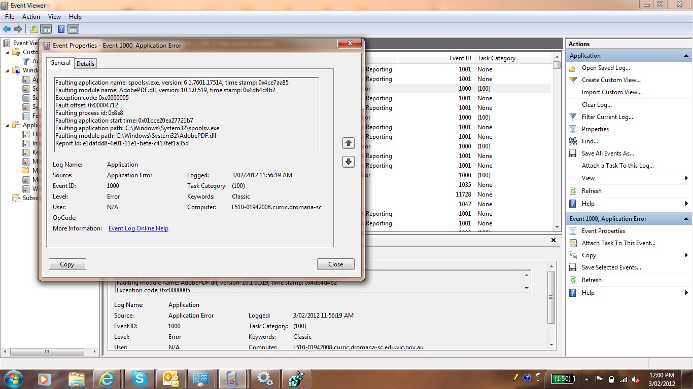

Many sysadmins have probably encountered a situation where due to a nasty print driver (& associated printer) the Print Spooler service stops and upon starting it up again manually decides to stop again. Being stuck in this loop is nothing but pure frustration however if you are smart about the problem, it shouldn't worry you for long.

First thing to do is check the event viewer. This tool is a god-send and if you are not already familiar with it, I suggest you immediately introduce yourself and become friends. You should be presented with a error something similar to the following:



The key in the above image is **AdobePDF.dll** is listed under the **Faulting Module Path**. Pesky Adobe has done it again in this case.

Now we know which driver is causing the spooler to fail (and in this case we can quickly surmise which printer it is based off the driver name) we can simply remove the printer from Devices & Printers right? Wrong. The second we start up the Print Spooler service its going to come crashing down once again.

So how do we remove a printer when we have no access to it via the GUI? Regedit, another friend you should familarise yourself with (having said that, knowing the registry of Windows from top to bottom is a mean feat, I have doubts I will ever know it THAT well).

Right, load up regedit and dive into

```
HKEY\LOCAL\MACHINE\SYSTEM\CurrentControlSet\Control\Print
```

Under the Print key, you will find 3 keys that are of interest today; ```Environments```, ```Monitors``` & ```Printers```.

Under these 3 keys, purge anything to do with the aforementioned driver (in this case **AdobePDF.dll**) and you should be able to safely bring back up the Print Spooler service


As with any circumstances involving Regedit, backup before you start changing. You have been warned!


There you have it, a nice and quick way to solve your print spooler failure loops.
