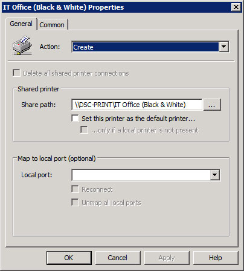
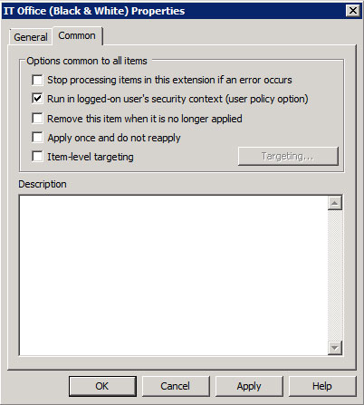

Ahhhhh printers, I am convinced life would be better without them (I don't even have one at home). None-the-less, printers are a staplemate of businesses across the globe and as SysAdmin's it is our job to ensure clients have access to the printers all while making it as seamless as possible.

Over the seven years I have been at my current place of employment, I have gone from deploy printers via KIX script (more or less **net use** with variables) to Group Policy and finally Group Policy Preferences. Despite using 3 different methods not one has worked satisfactory... that is until now.

Before I get into the Group Policy deployment side of things I will first give you an idea of the environment I am working with.

- Windows Server 2008 Print Server / Domain Controller _(could have gone 08 R2 but didn't want the headache of x64 drivers AND x86 drivers)_
- 30+ different print queues with varying models and brands ranging from HP Black & White Lasers to Xerox Multifunction Devices (fancy name for Photocopiers that can fax/print/scan/copy)
- Windows 7 SP1 clients predominately with a scattering of Vista and XP clients (all x86)
- Majority of the clients DO NOT have administrative privileges and thus are standard users

With the above in mind lets dig into the Printer Group Policy I use:

In the below section we share our each printer queue that is to be deployed via Group Policy:

**User Configuration>Preferences>Control Panel Settings>Printers**

Go ahead and create a new **Shared Printer** with the following properties:


    
    


The three important bits is the **Action** is set to **Create**, **Share path** is set to the SMB share path of your printer (use the **...** button to browse and point the printer if you do not know the path from memory) and that **Run in logged-on user's security context (user policy option)** is ticked.

Now according to Microsoft, all that is left is to apply the policy to your choice of Organisational Unit and you should have printers being deploy left, right and centre. Depending on your environment this could be true however in our case this is not enough.

In the same Policy we are adding the printers go to the below sections and add the following:

**Computer Configuration>Policies>Windows Settings>Security Settings>Local Policies>User Rights Assignment**

- Load and unload device drivers
    - BUILTIN\Users

**Computer Configuration>Policies>Windows Settings>Security Settings>Local Policies>Security Options**

- Devices: Prevent users from installing printer drivers
    - Disabled

If it is not obvious already the above to settings will allow standard users to install printer drivers. Makes sense right?

Now with the above complete this was enough for most of our printer queues to be deployed without issue. Unfortunately & weirdly all our copiers refused to deploy (along with a couple of lasers). I am unsure what the technical reason that connects all these printers together but after reading what others have done when deploying printers via Group Policy Preferences I applied the next few policies:

**Computer Configuration>Policies>Administrative Templates>Printers**

- Only use Package Point and print
    - Disabled
- Package Point and print - Approved Servers
    - Disabled
- Point and Print Restrictions
    - Disabled

With the above applied, all 30+ printer queues came through.

With this many printer queues, logon times are significantly increased upon first logon to a machine while the drivers are pulled from the Print Server and installed. On shared machines this can be frustrating to the end user (1:1 machines aren't affected as subsequent logins do not have to reapply the policy unless there is a change) so my next task is to test if deploying the printers in **Computer Configuration** rather than **User Configuration** will only install the printers upon first domain user login and any subsequent domain user login will use the existing drivers/configuration.

Now go forth and give them all the printers they can handle!
