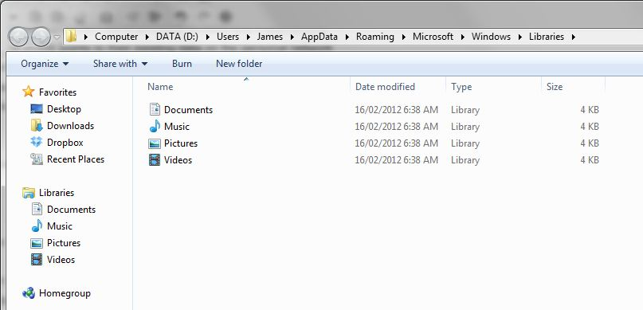

Windows 7 is arguably one of the best operating systems Microsoft have put out in their history in the game. It was quite a joyful experience to migrate from Vista to 7 across the enterprise (really painless). There was one thing that always bugged me... Libraries. They are supposed to make it easier to keep your files organised but I personally think segregated folders already did this rather well (My Docs, My Music, My Pictures etc...).

Like anything though, we must embrace the change - twist and manipulate it to help further the machine to glory. Unfortunately, Microsoft never really provided any enterprise methods to manage the Libraries experience.

The problem for the user as it stands is despite having a personal network drive/share (commonly mapped to H:\) attached to their Active Directory account and implementing folder redirection so the local profile points to their existing data on the personal network drive/share Windows 7 defaults to Libraries whenever you want to open or save a file. This can lead to a user save a document on the local machine which is a strict NO-NO on a shared machine. This document is forever lost to them unless they go back to the original machine.


Frustrating to both the user and the sysadmin but the light is shining; we can fix it!

## Requirements

- [Notepad++](http://www.google.com.au/url?sa=t&rct=j&q=&esrc=s&frm=1&source=web&cd=2&ved=0CD4QjBAwAQ&url=http%3A%2F%2Fnotepad-plus-plus.org%2Fdownload%2F&ei=Y4R2T__BCrCXiAfNvaz8BA&usg=AFQjCNH3EDQgV_6YH8Ki3fJPoyEX65i3Rw "Notepad++ Download page") (or any other text editor that provides a right-click contextual menu entry)

## Steps

Providing the current user account you are using has not changed the default Library experience lets navigate to ```%userprofile%\Appdata\roaming\Microsoft\Windows\Libraries\```. What you will be presented with is your four existing Libraries and if you double-click on any of them, they will take you to the particular library. So they are a shortcut right? Nuh-ah.



Tricky Microsoft at play here. These are actually .library-ms files which are XML based files which control all aspects of that particular library ranging from the icon used, location(s), private or public and more.

Lets open up the Documents Library in Notepad++ and take a look by right-clicking on the Documents file and using the **Edit in Notepad++** menu item.

```xml
<?xml version="1.0" encoding="UTF-8"?>
<libraryDescription xmlns="http://schemas.microsoft.com/windows/2009/library">
  <name>@shell32.dll,-34575</name>
  <ownerSID>S-1-5-21-2313706764-2019408444-1191095620-1001</ownerSID>
  <version>8</version>
  <isLibraryPinned>true</isLibraryPinned>
  <iconReference>imageres.dll,-1002</iconReference>
  <templateInfo>
    <folderType>{7d49d726-3c21-4f05-99aa-fdc2c9474656}</folderType>
  </templateInfo>
  <searchConnectorDescriptionList>
    <searchConnectorDescription publisher="Microsoft" product="Windows">
      <description>@shell32.dll,-34577</description>
      <isDefaultSaveLocation>true</isDefaultSaveLocation>
      <simpleLocation>
        <url>knownfolder:{FDD39AD0-238F-46AF-ADB4-6C85480369C7}</url>
        <serialized>MBAAAEAFCAAAAAAAADAAAAAAAY0gAAQBRAAAAQjWHqIhPzcAnvzZQ+K5MHQib76aZwOzBAAEAAAAAAAABAAAAAAAAAAAAAAAAAAAA8WAUAwHQB+TQDi66kGEiiNCAsCMw0ZGA8CR6wFAAAAAAAAAAAAAAAAAAAAAAAAA0BQMAAAAAAQLAVgNRAQVzVmczBAYAgAAEAw7+qCQyTVLAVgNqAAAAMCAAAAAAEAAAAAAAAAAAAgNAAAAAAQVAMHAlBgcAMHAAAAQAMHAoBQZAwGAsBwMAIDAuAAZAwGAsBALA0CAyAQMAgDAxAwMAAAAUAATAEDAAAAAAsCQklDEAoUYtV2cAgDAIAABA8uvqAETVtCQkljKAAAAmAAAAAAACAAAAAAAAAAAAAAAAAAAAoEAhBQbAUGAzBAAAQBAACQMAAAAAAwTAVNnRAARPNUVNVkfxAAAoBACAQAAv7rKA1UVGBUqJpCAAAwLAAAAAAgAAAAAAAAAAAAA+AAAAAAAEBwbAMGA1BQbAUGAuBAdAMHAAAAQAMHAoBQZAwGAsBwMAIDAuAAZAwGAsBALA0CAyAQMAcDA3AAMAAAAYAAAAsEAAAAHAAAABAAAAwBAAAQMAAAAAAAAAoEAAAQFAAAADAAAA8WC+TGEAAAAEFEVBBAR6wVVzVmczxlSh1WZzxFRvNWdtVmb0NHAAABAAAQBAAAoFAAAA0WAAAAHAAAALAAAgCtmT3/jj8qRtSLbFi0ApdcbBAAAZCAAAkAAAAajAAAAxMFUTJuiYZEvMhzQ7y/ETaCmt5ccAAAAEAAAAAwHAAAAvAAAAMFAtAQMA0CA1AQLAIDAxAQLAIDAzAQMAMDA3AAMAYDA3AgNAQDAtAgMAADAxAQOAQDAwAAOAQDA0AANA0CAxAQMAkDAxAAMAkDA1AgNAIDAwAQLAEDAwAAMAEDAAAAAAAAAAAAAAAAAgBAAAMAAAAKWAAAAAAAAA02b092avBAAAAAAAAAAAAgNA8IHTe5ON5K1tMS/UUePxgY8o21OhHxkZD+yOJmTibDAPyxkXuTTuSdLj0PFl3TMIGPqdtT4RMZ2gvsTi5k4AAAAAA</serialized>
      </simpleLocation>
    </searchConnectorDescription>
    <searchConnectorDescription publisher="Microsoft" product="Windows">
      <description>@shell32.dll,-34579</description>
      <isDefaultNonOwnerSaveLocation>true</isDefaultNonOwnerSaveLocation>
      <simpleLocation>
        <url>knownfolder:{ED4824AF-DCE4-45A8-81E2-FC7965083634}</url>
        <serialized>MBAAAEAFCAAAAAAAADAAAAAAAY0gAAQBRAAAAAF2EYChPzcArdSUlFc0MHwanEVZBHNzBAAEAAAAAAAABAAAAAAAAAAAAAAAAAAAAsZAUAwHQB+TQDi66kGEiiNCAsCMw0ZGA8CR6wFAAAAAAAAAAAAAAAAAAAAAAAAA0BQMAAAAAAQLAVgNRAQVzVmczBAYAgAAEAw7+qCQyTVLAVgNqAAAAMCAAAAAAEAAAAAAAAAAAAgNAAAAAAQVAMHAlBgcAMHAAAAQAMHAoBQZAwGAsBwMAIDAuAAZAwGAsBALA0CAyAQMAgDAxAwMAAAAUAAeAEDAAAAAA0CQjhTEAAVdixWajBAAiBACAQAAv7rKANPVtA0Y4oCAAAgmBAAAAAQAAAAAAAAAAAAA4AAAAAAAQBQdAIGAsBQaAMGAAAAQAMHAoBQZAwGAsBwMAIDAuAAZAwGAsBALA0CAyAQMAgDAxAgNAAAAWAAgAEDAAAAAA0CQjhTEAQ0TDVVTF5XMAAAaAgAAEAw7+qCQzTVLANGOqAAAA4ZAAAAAAEAAAAAAAAAAAAgPAAAAAAARA8GAjBQdA0GAlBgbAQHAzBAAAAEAzBAaAUGAsBAbAMDAyAgLAQGAsBAbAwCAtAgMAEDA4AAMAEDAAAAGAAAAMBAAAwBAAAQAAAAAcAAAAEDAAAAAAAAALBAAAUBAAAwAAAAAvlg/kBBAAAARBRVQAQkOcV1clJ3ccBVdixWajxFRvNWdtVmb0NHAAABAAAQBAAAouAAAAkZAAAAHAAAALAAAg+KJI1O5cjaRBKO/5VGC2QTmBAAAZCAAAkAAAAajAAAAxMFUTJuiYZEvMhzQ7y/ETaCmt5ccAAAAEAAAAAwHAAAAvAAAAMFAtAQMA0CA1AQLAIDAxAQLAIDAzAQMAMDA3AAMAYDA3AgNAQDAtAgMAADAxAQOAQDAwAAOAQDA0AANA0CAxAQMAkDAxAAMAkDA1AgNAIDAwAQLAEDAwAAMAEDAAAAAAAAAAAAAAAAAgBAAAMAAAAKWAAAAAAAAA02b092avBAAAAAAAAAAAAgNA8IHTe5ON5K1tMS/UUePygY8o21OhHxkZD+yOJmTibDAPyxkXuTTuSdLj0PFl3jMIGPqdtT4RMZ2gvsTi5k4AAAAAA</serialized>
      </simpleLocation>
    </searchConnectorDescription>
  </searchConnectorDescriptionList>
</libraryDescription>
```

Now if we are going to deploy this en-masse, we first must eliminate a few snippets to generalise it.

First we shall remove from line 20 to line 27. This removes the "Public Documents" folder from our Library (as we want the user to **just** use their network drive/share and not anything on the local machine)

Next, take out the ```<ownerSID>...</ownerSID>``` line followed by anywhere you find the ```<serialized></serialized>``` tags.

The only thing left is to change the location of Documents library, in our case we want to point to ```H:\My Documents\``` but you can point it to where ever you like. To do so, edit between the ```<url>...</url>``` tags and should end up with something like the following:

```xml
<?xml version="1.0" encoding="UTF-8"?>
<libraryDescription xmlns="http://schemas.microsoft.com/windows/2009/library">
  <name>@shell32.dll,-34575</name>
  <version>8</version>
  <isLibraryPinned>true</isLibraryPinned>
  <iconReference>imageres.dll,-1002</iconReference>
  <templateInfo>
    <folderType>{7d49d726-3c21-4f05-99aa-fdc2c9474656}</folderType>
  </templateInfo>
  <searchConnectorDescriptionList>
    <searchConnectorDescription publisher="Microsoft" product="Windows">
      <description>@shell32.dll,-34577</description>
      <isDefaultSaveLocation>true</isDefaultSaveLocation>
      <simpleLocation>
        <url>H:\My Documents\</url>
      </simpleLocation>
    </searchConnectorDescription>
  </searchConnectorDescriptionList>
</libraryDescription>
```

Nice and basic. No riff-raff, just does the job and does it well. Save the file name it ```Documents.library-ms``` and we are half way there.

Go ahead and do the same for Music, Pictures and Videos library files if you would like to redirect them as well.

Part 2 will cover deployment of our new settings to all the computers in your enterprise via Group Policy Preferences
