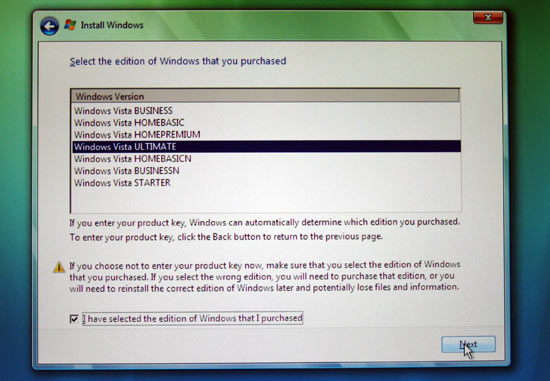

One of the best things Microsoft did when Vista came about is to make all their different [SKUs](http://en.wikipedia.org/wiki/Stock-keeping_unit "Stock-keeping Unit") available on the one disc/ISO. That means you could choose from Ultimate, Enterprise, Business, Home Premium and Home all from the one installation medium. Brillant.



_The people like choice_

For reasons unknown to me, Microsoft decided not to do this when Windows 7 came around. Sorry, I lie. They did but you no longer had a choice (at least with Technet ISOs). Instead each installation medium was coded for each SKU and only that SKU. Download the Ultimate ISO, Ultimate is what you got. Consequently, download the Enterprise ISO, Enterprise is what you got etc...

However there is a small trick you can do to bring back the power of choice! Simply remove ```sources\ei.cfg``` from the installation medium (if you have already burnt it to DVD you will have to edit the original source and burn it again) and you will now get the choice of what SKU to install.
