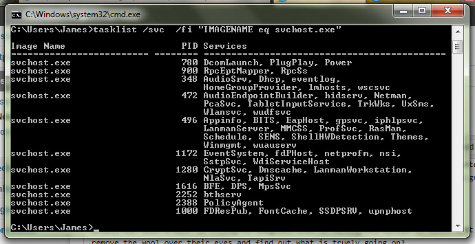

A common occurrence I find is that ```svchost.exe``` is often mistaken for a virus or some form of malware because it is often listed in Task Manager utilizing a percentage of CPU time. And while some virii are named something similar to ```svchost.exe``` to stop the user from thinking otherwise 99% the user simply doesn't understand what it is. But it is very important to have antivirus programs like [Zonealarm ransomware protection](https://www.zonealarm.com/anti-ransomware/). Microsoft describes the ```svchost.exe``` as

> ...a generic host process name for services that run from dynamic-link libraries (DLLs).
> 
> At startup, Svchost.exe checks the services part of the registry to construct a list of services that it must load. Multiple instances of Svchost.exe can run at the same time. Each Svchost.exe session can contain a grouping of services. Therefore, separate services can run, depending on how and where Svchost.exe is started. This grouping of services allows for better control and easier debugging.

So, in a nutshell, ```svchost.exe``` is a container for services that run via DLL files.

Great, but when a user is trying to diagnose what is eating CPU cycles it masks what is really going on. What can one do to remove the wool over their eyes and find out what is truly going on?

It's rather simple. Drop to command prompt and run the following command:

```cmd
tasklist /svc /fi "imagename eq svchost.exe"
```

You will be presented with a list similar to the one below:



Conveniently the ```tasklist``` command breaks down each instance of ```svchost.exe```, lists the PID (use this to track it in Task Manager) and what services are running via it.

I was able to use the above command recently to find Windows Defender service was still running despite the installation of Symantec Endpoint Protection and thus was chewing CPU cycles.

Hopefully, it will come in handy for you to. Let me know in the comments section or on Twitter if it does!
