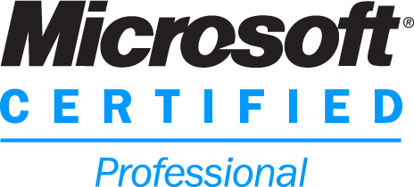

As of yesterday I am now a **Microsoft Certified Professional** (_Technology Specialist: Windows 7, Configuration_ for those keeping score at home).

For a long time I flirted with the idea of getting certified for all kinds of things but never put in the time to get it done. The biggest barrier is I am not much of a big reader of anything in text-book form _(and is most likely why I never did as well as I should in Physics and Math Methods back in my VCE days)_. So while I wanted the title it just never came about.

That was a few years ago and since then I have under gone a change in mindset when it comes to all things life. I began personal training after gathering with friends and realising we all wanted more from ourselves. This began a chain of events that ultimately resulted in me being more confident in myself, more willing to take risks, more willing to put myself outside my comfort zone and most importantly hungry to be the best I can possibly be.

I cannot stress how important that pushing my body in personal training is to being a better me (or you). It isn't purely about physical appearance or strength _(that's a great bonus)._ Some people may write off this kind of thing as macho or neanderthal but that is half the point. Our day-to-day lives (especially for people in IT) are simply boring for the body, yet our body was designed from the outset to move, to be physical. Without this being satisfied, our body as a whole is working to nowhere near its peak. If we want to train our brain to be more intelligent it will be quite a struggle if the body is in poor shape as they are both connected intricately. In short, just like it has always been stressed to have a balanced diet of food, so too should you have a balanced regiment of training the body and the mind.

Fast forward to the start of June and I am on Long Service Leave from my current job and rather than take a holiday I decided to help out a start-up based in Hong Kong that develops golf training and analysis devices that I (and many of my close friends) am invested in. I helped out where I could, doing things like soldering, assembly work, social media marketing and many other tasks no way in relation to my career in IT.

So how does this relate to becoming certified you ask? Well, around mid August, the work I could get involved with was starting to dry up. It is at this time that I started to review my resume with job prospects being discussed, I found that while my 7 years of experience is phenomenal at my age and is invaluable I couldn't help but want something more on my resume...something to give it a bit of polish. My mind wandered back to certifications and I had a _eureka_ moment that I could use all this free time to study with the possibility of earning that industry title.

Excited by the prospect I started to research what I could achieve with the limited resources I had at my disposal and my current experience. When I released there was a testing centre 10 minutes away from my current location and it was more than %50 cheaper here in Hong Kong than back in Australia the seed was planted.

_In the next part I will share what resources I used to achieve my certification and more musings over the entire process._
