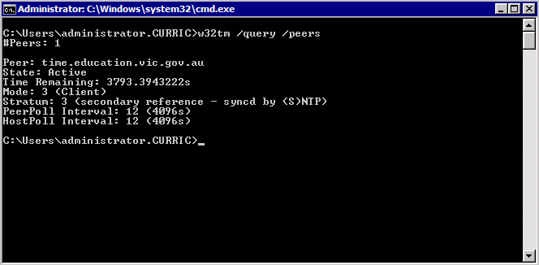

Any any Windows domain environment one of the most overlooked but ultimately crippling when things are wrong component is time. If your Domain Controllers, other servers and clients are not in sync with one and another _you're going to have a bad time_.

Yes I just went there, internet memes and all...

So what are the best methods for keeping things in sync. Windows does a good job of keeping everyone in sync with your nearest Domain Controllers but if your Domain Controllers are getting their time from different sources or are muddled up possibly due to virtualization that is when you will start to get grief.

I recommend doing two things:

## Set an external network time source

Go to your Primary Domain Controller and type the following at an elevated command prompt:

```cmd
w32tm /config /manualpeerlist:"timeserveraddress.com" /syncfromflags:manual /reliable:yes /update
```

Where ```timeserveraddress.com``` is replace with your favourite reliable NTP server. If you don't have one in mind a good place to start is [pool.ntp.org](http://www.pool.ntp.org) and pick a server that is closest to you geographically.

Once set, let's confirm our command has worked by typing the following at an elevated command prompt:

```cmd
w32tm /query /peers
```

You should receive an output similar to the following:



Once you have confirmed the external time source is set the next move is to get the rest of your ducks (Domain Controllers) in a row.

## Set your Primary Domain Controller as the time source for the other Domain Controllers

Do the following at an elevated command prompt on the rest of your Domain Controllers:

```cmd
net time \\primarydomaincontroller /set
```

Where ```\\primarydomaincontroller``` is replace with the NETBIOS name of your Primary Domain Controller that was just setup with an external network time source.

That's it, all done. Your clients will look to their nearest Domain Controller for their time and those Domain Controllers will get their time from the Primary Domain Controller which will get the time from your choice of external time source.


This setup is just a recommendation. You can switch things up to increase redundancy as the current setup has two single point of failures (external time source and Primary Domain Controller). To increase redundancy simply point your additional Domain Controllers to the same external time source (or different ones if you want SUPER redundancy but I don't recommend this as it could introduce error rather than prevent it) rather than your Primary Domain Controller

