There will certainly be a few people out there who are either doing it already or investigating upgrading their Virtual Machine host from 2008 R2 with Hyper V _(or Hyper V Server R2)_ to Server 2012 with Hyper V _(or Hyper V Server 2012)._

As a sysadmin I always look forward to deploying new technology as in the majority of the time, newer is better. But there is always the fear of how messy things could get or what things will break in the transition.

Safe to say, with a minimal forward planning migrating your VMs to the latest in a Microsoft virtualization is really really easy.

When dealing with Hyper V, you should understand the storage process for VMs which are divided into two major sections:

- Data Root location
    - _This is where your XML, BIN and VSV files are stored. These are the configuration and status files for your VMs_
- VHD location
    - _This is where your VHD and AVHD files are stored. These are the file system files for your VMs_

For a deeper explanation of each file and the Hyper V VM file structure head on over to the following article by the Virtual PC Guy; [Understanding where your virtual machine files are \[Hyper-V\]](http://blogs.msdn.com/b/virtual_pc_guy/archive/2010/03/10/understanding-where-your-virtual-machine-files-are-hyper-v.aspx "Understanding where your virtual machine files are [Hyper-V]")

## Test Environment

Before I go into the process I'll give you a quick run down of my test environment:

- Windows Server 2008 R2
- Hyper V Role
- 2 Volume setup
    - C:\ System partition
    - D:\ Data partition including VM configuration and VHD storage

## Prepare Hyper-V host

By utilizing the steps outlined in my [previous blog post](), I installed Windows Server 2012 via booting off USB _(Custom Install, wiped Volume 0, kept the Data volume intact)_. Once the OS was installed I setup my networking, enabled RDP and installed the Hyper V role via the new Server Manager.

## Begin migration

With the Host setup, lets start migrating!

By default Server Manager is open upon login on Server 2012 so let's go ahead and go to **Tools>Hyper V Manager**

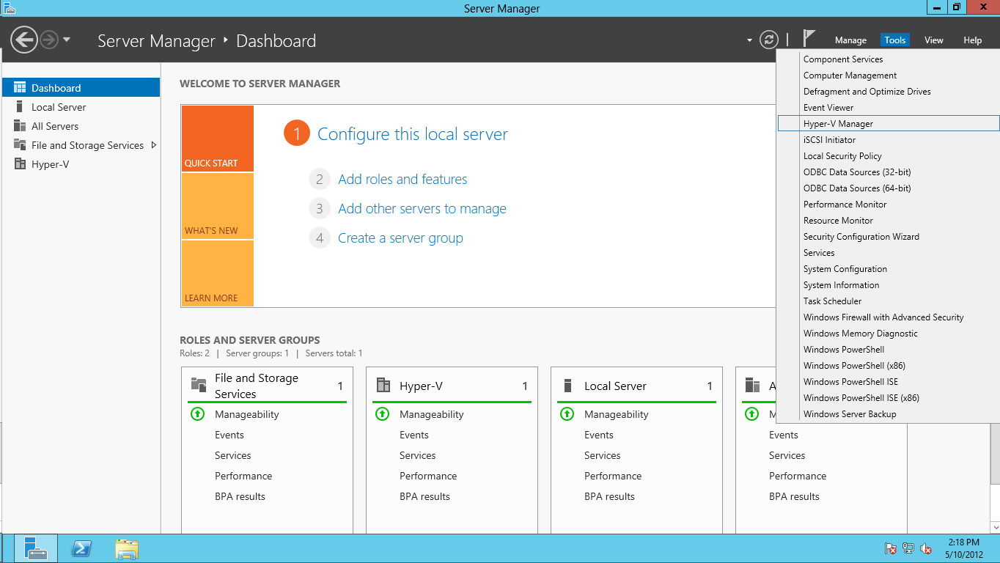

We now have a blank Hyper V Manager awaiting our VMs. Let feed it a VM by going to **Import Virtual Machine...** on the right hand side menu bar

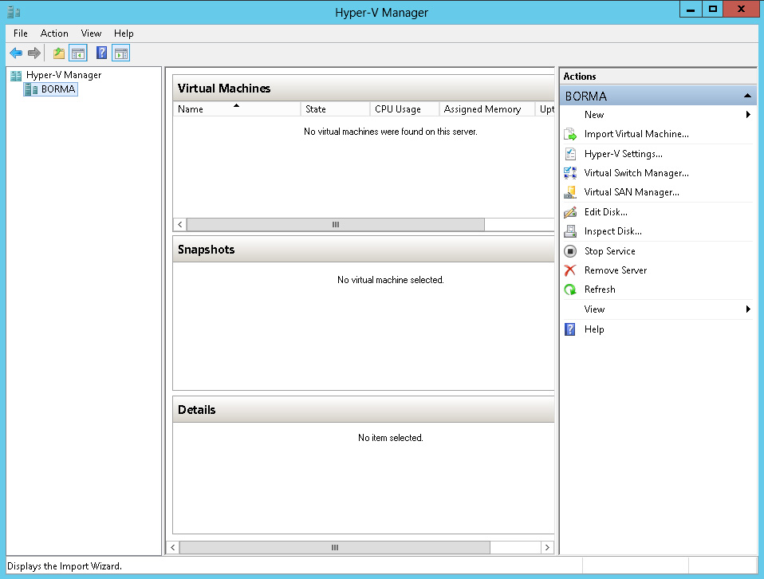

A new window should pop up giving you a run down on what's about to happen (if you were not aware already). Just hit **Next** to get started.

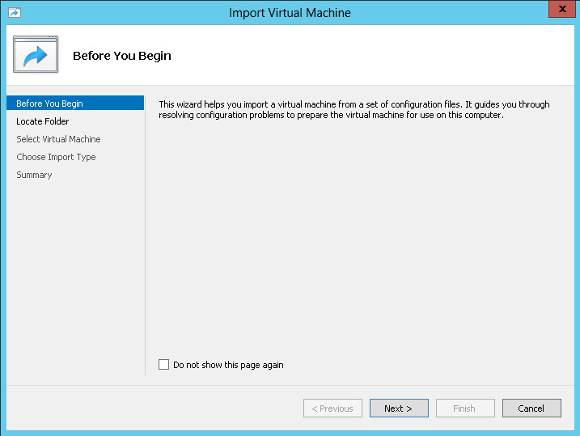

Now it will prompt us for the location of our VM data root as explained earlier. Hit **Browse** and point to the folder that stores all your VM folders container the config files and hit **Next**.

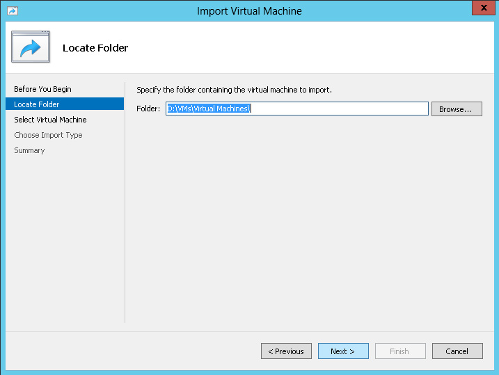

After scanning your folder of choice the wizard will list all the possible VMs for import. Click your poison and hit **Next**

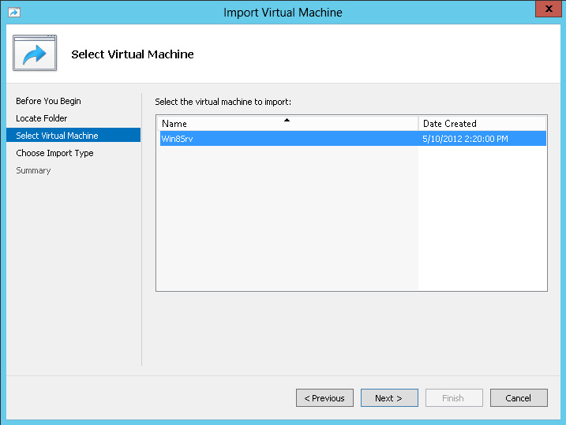

Now we get a couple of options on how exactly we would like to import our VM. I love this. Rather than just one method fits all we get 3 simple (but powerful) options.

- Register the virtual machine in-place (use the existing unique ID)
    - _The VM will be imported using existing details and existing storage location_
- Restore the virtual machine (use the existing unique ID)
    - _The VM will be imported using existing details but moved to the new storage location defined in Hyper V Manager_
- Copy the virtual machine (create a unique ID)
    - _The VM is copied to the new storage location and generated a new ID as if it's a new VM. This option would be used if you have a template VM already setup and would like to use it to spin up a new VM_

Pick the option that suits you best and hit **Next**. For this example I chose the first one as my VMs are already where I want them to be

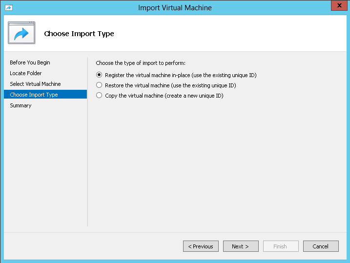

Now the wizard would like the location of the VHD storage location. Like the VM location step, hit **Browse** and locate to where your VHDs are stored and hit **Next**

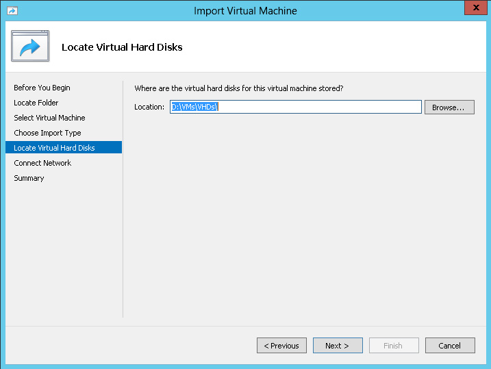

Now the wizard would like to set up the virtual network adapters for the Virtual Machine. Naturally because this is a new host it cannot find the old virtual network adapters. But fear not, rather than freak out you are simply given the option to either not connect one at this time or choose from an adapter on the new host. Pick what suits you and hit **Next**

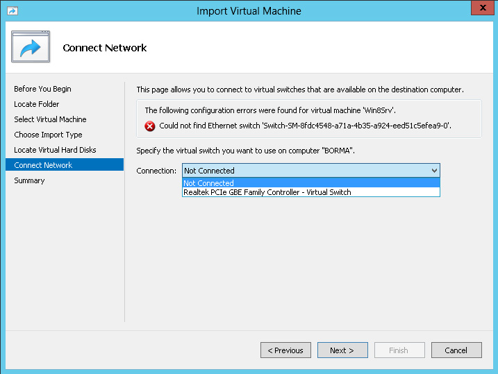

Before importing your Virtual Machine the wizard gives you a summary of what is about to happen. If all the details are up to scratch hit **Next** to do the import

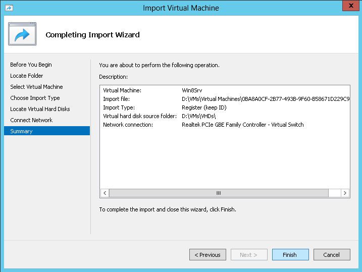

Import complete, VM now available in the Hyper V Manager. Let's connect to and start-up the VM to make sure the import was successful

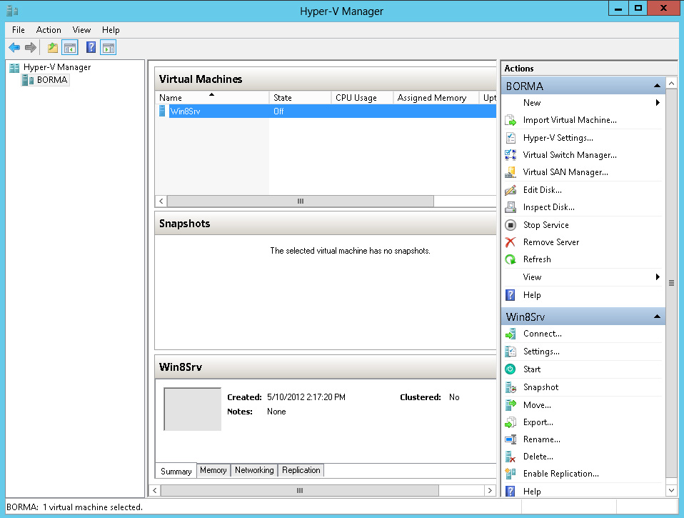

Would you look at that, our Virtual Machine has been imported with the simplest of ease and running like it nothing happened

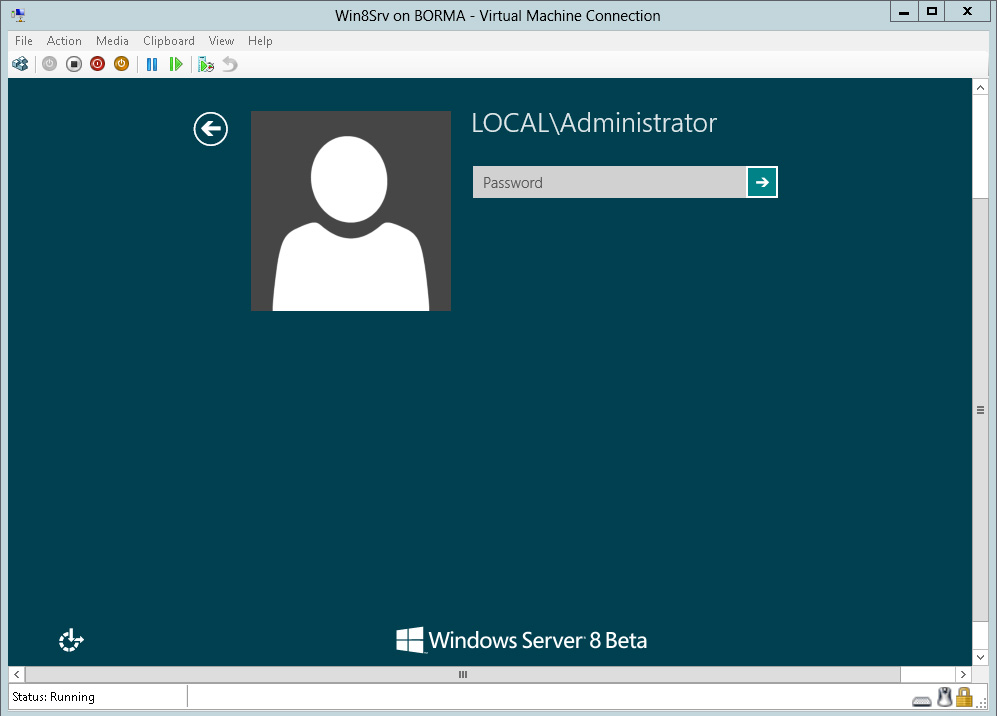

There you have it. Do not fear the upgrade (reaper) this time around fellow Sysadmin's, you won't feel a thing
