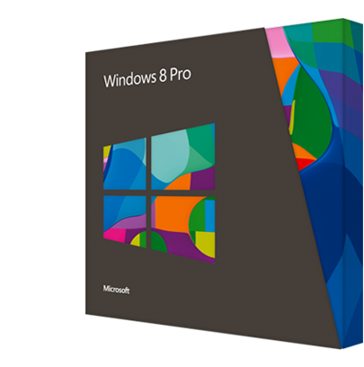

The day has come and Microsoft has released Windows 8 to great fanfare as you can see below:

[Tweets about "#windows8"](https://twitter.com/search?q=%23windows8) 

If you have yet to purchase a copy there are two current promotions you should be aware of.

The first promotion applies to those who have purchased a PC preloaded with Windows 7 between the 2nd of June, 2012 and 31st of January, 2013. You lucky people can pickup Windows 8 Pro Upgrade for $14.99 @ [http://www.windowsupgradeoffer.com/](http://www.windowsupgradeoffer.com/)

The second promotion is a launch special pricing on Windows 8 for just $39.99 @ [http://windows.microsoft.com/](http://windows.microsoft.com/)

Get it while its hot folks!
