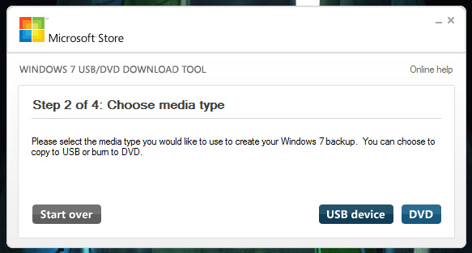

So you're one of the lucky people (Technet, MSDN etc...) to have early access to Windows 8 or Windows Server 2012. You stayed up eagerly awaiting the release of the ISO and battled with everyone else for bandwidth as you watched the progress bar on your download tick ever closer to completion. Now what?

If you are like me and are moving away from traditional removable storage of CD/DVDs (maybe your cool and rock Blurays too?) how do you use your shiny new ISO to install the latest version of Windows?

Thankfully Microsoft understands this very situation and a few years ago they released the **Windows 7 USB/DVD Download Tool**. Don't be fooled by the name, this tool works perfectly for Windows 8/Server 2012 largely in part because the installation system used by Windows hasn't really changed since Windows 7/2008 R2 with its use of WIMs.

You can get the rundown on the tool [here](https://www.microsoft.com/en-us/download/windows-usb-dvd-download-tool "Windows 7 USB/DVD Download Tool") or just click [here](http://wudt.codeplex.com/ "Download Windows 7 USB/DVD Download Tool") to download it directly

Once you have downloaded and installed the tool it will run you step by step through the process of converting your ISO file to either a bootable DVD disc or (and for our purpose, more importantly) a bootable USB.

Lets fire up the tool and get started.

First question that will be asked of you is where is the ISO file located?

Next up is what type of media do you want to output the ISO to?

Following the media type choice you are now asked to insert that media into your computer (I already have my flash drive inserted and selected)

Subsequently after the selection of the media, the tool will format the media (if using a USB flash drive), copy the files from the ISO and then make it bootable

And process complete

Lets take a look at the contents of the drive to see what exactly has it done

As you can see our flash drive becomes exactly like a retail installation disc out of a proper Microsoft Windows box. We can double-click on Setup.exe and launch the installer...

Ta da. There you have it, you can now plug in your USB flash drive, boot off it and get installing. Super simple stuff from Microsoft and a geninually useful tool.
