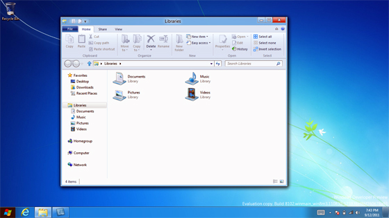
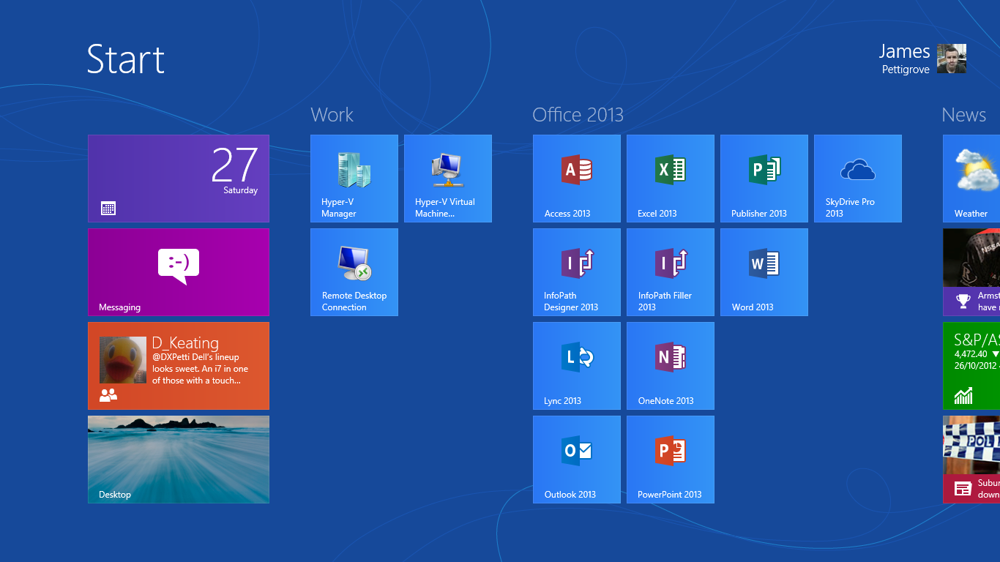
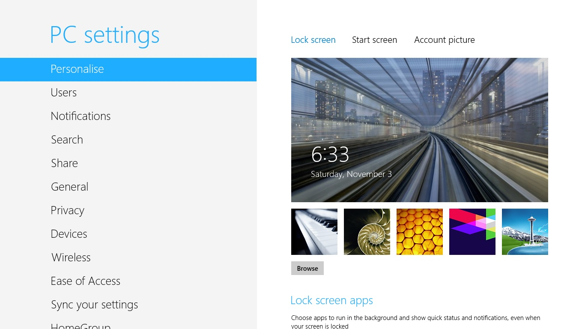
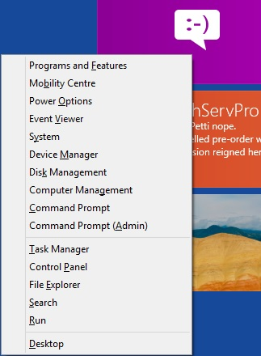
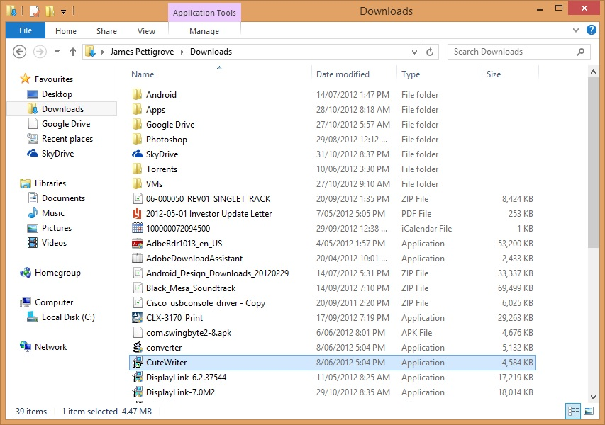
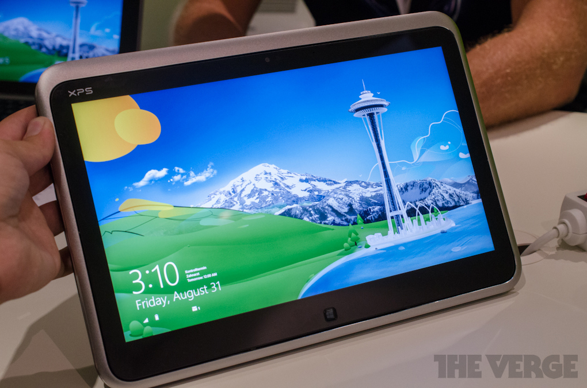

No doubt you are aware that Microsoft's latest operating system for PCs (and now ARM powered tablets, hybrids etc...) has been released to the world with varying reviews. Regardless of the outcome Microsoft have managed to cause a stir and generate a lot of talk.

Last Friday I upgraded my HP Folio 13 from Windows 7 Ultimate to Windows 8 Pro and before I begin I must point out I had no intention of doing so. While I have kept my eye on the progress the men and women in Seattle have been making the last time I played with Windows 8 was when it was in the Developer Preview stage and looked a little like this:

It has long since been polished, refined, improved and in general is a different beast all together.

I'll admit, all the hype surround Windows 8 (mainly around the Surface RT, released side by side with Windows 8) sucked me in a little but it was the [special price of $15]() to purchase an upgrade copy of Windows 8 Pro that hooked me. I can never remember a copy of Windows being this cheap (legally ha!) so I couldn't resist such a bargain.

## Upgrade Process

I won't go into too much detail here as I will have a post displaying the step by step procedure of performing the upgrade but I can safely say it was painless.

You can kick off the upgrade by heading to [http://windows.microsoft.com](http://windows.microsoft.com) and clicking on one of the many buy buttons. This will start a small download for the Windows 8 Upgrade Advisor. You may know this tool's previous versions used for XP to Vista to 7 upgrades so the first action it performs won't be a surprise to most. For the rest, a viable option can be to get their system to a [computer repairs new farm](https://www.computerrepairsnewfarm.com.au), as fiddling with the system on one's own can perturb it and can incur undue costs.

As soon as you run the tool it will scan your PC and list any applications and drivers that will conflict or not available with Windows 8. I had a handful of applications that wouldn't play nice (according to Microsoft) in the new version but given that they were non-essential to me I pressed on. The next few steps asks what type of upgrade you would like to perform (keep apps, personal files & settings, keep personal files & settings, keep nothing), what version of Windows 8 you would like to purchase and finally your billing information for the purchase.

After ticking all the right boxes the upgrade was underway. The upgrade process would not have taken any longer than 1/2 hour and before I know it I was in the first run sequence of Windows 8. After connecting to my local wireless networking and signing to my existing Windows Live account (which was turned into a Microsoft account) I was presented with the new (but controversial) Start screen.

First I did was to check what pieces of the puzzle I would have to fill in myself...and by that I mean install drivers. On first inspection of the Device Manager I was missing 2 or 3 drivers but I did note in the bottom right Windows was still performing some device installation so I left the computer to its own devices for a few minutes. Upon my return I was surprised to find all device drivers were accounted for. No standard or generic drivers, all proper manufacturer drivers.

Colour me impressed.

This was an amazing start to my Windows 8 experience. For the first time I had installed Windows on a computer and from the beginning I am ready to go as soon as I start it up (more or less). Not something I am used to experiencing with Windows. I will mention that because my laptop is a Ultrabook I would suspect that Intel and Microsoft cooperated closely to ensure the 'Ultrabook Experience' would not be a negative one. This is the benefit you get to using a computer that uses a standardised architecture so not everyone will have success to this degree that I have experienced.

## User Experience

Alright, lets talk about the big elephant in the room...the replacement to the Start Menu, the Start Screen.

This major change to Windows has certainly rubbed a lot of people the wrong way. I quietly think though that the majority of these people have yet to use Windows 8 for anything more than a few hours.

Let's think about what the previous Start Menu was used for: Launching programs and accessing computer settings found in things like the Control Panel.

Under the new layout, you are 2 less (more likely 3) clicks away from your programs and therefore more efficient. You also have the added benefit of the programs treated in a similar way to apps on a smartphone or tablet in that you can group them, name them however meets your needs. This is a good example of Microsoft ripping out the stuffy 'PC' thinking of doing things and focusing more on how the user uses their computer.

And in that same mindset the Control Panel now has a friendly front end called 'PC Settings'. Gone are the mired of icons that confuses most users, replaced with options covering 99% of what a user really wants to change on their computer.

The only thing that I would think most users would need is the ability to remove programs but I guess most don't even bother uninstalling programs? Having said that, 'Metro' apps can be uninstalled by a simple right-click, uninstall option.

Thus far, Windows 8 is very consumer minded. Microsoft have obviously paid close attention to how average people operate their computer, what they do and don't do and radically changed Windows around this thought.

But is that the whole story? Hardly...

Power users, who tend to be on the wrong side change, feel left out with all this focus on the average Joe. Fear not however as the best features in Windows 8 are aimed towards this crowd.

Multiscreen support **FINALLY** gets the much need love it deserves. You can get the taskbar (and customise the way it operates) across all your monitors. Wallpapers can be different across your monitors etc... Steven Sinofsky goes into great detail on the improve multi monitor support in [this MSDN blog post](http://blogs.msdn.com/b/b8/archive/2012/05/21/enhancing-windows-8-for-multiple-monitors.aspx "Enhancing Windows 8 for multiple monitors").

UAC by all accounts seems to be a lot less invasive by default (I never had a problem with UAC but others certainly detested its existence) which equals to less prompts when doing power user task.

My favourite feature would have to be what I call the 'Power Menu'

Hitting WIN+X keyboard combination brings you instant access to everything a power user or Sysadmin would require. Elevated Command Prompt...check, Control Panel...check, Event Viewer...check. I couldn't count how many times I have used this menu but I find it very very very handy and going back to Windows 7 (my work VM is still running Windows 7) I find I am a lot less efficient without it.

There is also plenty of features that are hidden by default so as not to flood a regular person with a mass of information that provides little to them but with a click of a button can be useful data for a power users.

Case in point is the new Task Manager. To most users, they will see nothing more than the following:

")

And if you hit the **More Details** option you get this:

")

1 click and you can have more information than Windows has ever provided.

I believe Windows 8 is balanced in what it brings to both the consumer user and the power user but there are a few elements that both groups will enjoy.

The overall visual scheme ala Metro of Windows 8 (and Office 2013) looks ugly in screenshots. I was none to impressed when I found I was losing my precious glass Aero theme but once again I have been made a believer.

The use of flat colours and lines combined with simple iconography and strong typography does exactly what Microsoft were saying all along...it brings the content of the window to the forefront and gives less focus on the window itself. Navigating things like File Explorer (previously Windows Explorer), the desktop version of Internet Explorer 10 and all the Office 2013 is much easier and less overwhelming than previous upgrades to Windows visual style.

To give you a glimpse on what I am muttering about lets take a look at File Explorer:

From the above image, 4 elements are immediately striking at attract attention

- File menu (highlighted by the dark blue button)
- Application Tools (highlighted by the contrasting purple button)
- Close window button (highlighted by the red button)
- Selected file (highlighted by the blue bar)

Nothing else immediately stands out which means you are focused on **what matters**.

This is very intelligent design that sadly probably will go unnoticed by most despite it affecting their experience in a positive manner.

## Performance

This will be brief; its faster, in all aspects. From installation, to booting, to shutting down, to sleeping, hibernating, launching applications, closing applications. Whatever Microsoft have done Windows 8 is certainly taking advantage of the SSD in my ultrabook. It saddens me a little that most people probably haven't experienced Windows running on a SSD. While Windows 7 certainly benefitted from an SSD inside your rig,

Windows 8 from the ground up had modern hardware in mind and it shows in the performance increase. While I have no hard numbers or metrics to back it up, it certainly feels faster and that counts more than timing the seconds till boot. Rather than thinking about how long something is taking, dreaming about what it would be like if I wasn't waiting, I am simply using the computer without giving it a second thought. This is a true mark of performance

## Conclusion

The term revolutionary has been thrown around by the media. I'm not going to go that far because frankly, I think Windows 8 is more evolutionary. The new Start Screen hasn't altered my world greatly. Yes, it has replaced a pillar of Windows that has been around longer than some people I meet and yes, it changes they were you interact with the computer but by on a traditional laptop setup combined with the way I use my computer the start screen (and the start menu before) is such a small part of my day that I remain un phased by it.

Don't misunderstand me though; the ability to snap apps like Messenger to the side of my screen is magical, having Hyper V baked right in has been a dream (my work VM saves it state in a second) or native ISO mounting which I will add, feels like just opening a folder (as the mounting element happens invisibly and quickly) are all little things that add up.

My Windows 8 experience has been nothing but painless and positive. I don't think anyone that tries it for an extensive period of time will continue to hold on to any grudges they previously had.

And to think, I have yet to experience Windows 8 with a touch enabled system. I can only think it will be much better...

