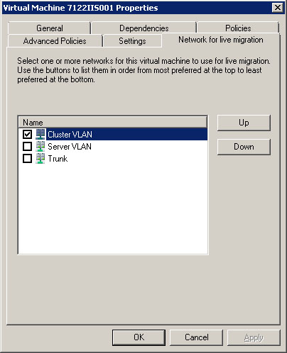

So you have a Hyper V 08 R2 (or maybe 2012) Cluster with a couple of nodes and it is all going rather well. You are live migrating machines and showing your friends how a packet barely drops during the process. High availability has become your buzzword.

We can make it better.

Hopefully in your design you have allocated a network to perform inter-node and general cluster communication such as Live Migration. Let's ensure that your defined network is being used for the migration rather than all the other networks (iSCSI, Management, Guest VM traffic etc...) that populate your cluster and make use of that allocated NIC.

1. In **Failover Cluster Manager** open up your cluster followed by **Services and applications**.
2. Double click on a guest VM that is online and while ensuring the Virtual Machine is highlighted in the status page left-click on **Properties** on the bottom section of the action bar on the right-hand side.
3. In the new window head, to the **Network for live migration** tab
4. In the list of cluster networks un tick any network that should not be used for live migration and/or using the **Up** and **Down** buttons to define the order of preference for live migration;

Now your live migration will take place over the networks you intended them to.

If you would further like to enhance these networks to increase the speed of your migrations I suggest taking a look at [Windows Server 2008 R2 Live Migration – “The devil may be in the networking details.”](http://blogs.technet.com/b/askcore/archive/2009/12/10/windows-server-2008-r2-live-migration-the-devil-may-be-in-the-networking-details.aspx "Windows Server 2008 R2 Live Migration – “The devil may be in the networking details.”") by Jeff Hughes.
