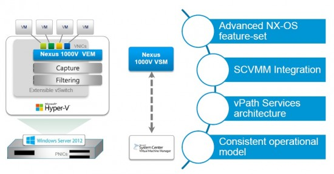

Exciting times for anyone in the Hyper-V camp or those looking. For a long time VMware has led the way with a extensible networking system whereby 3rd parties can connect their technology with the Hypervisor. I won't doubt that Microsoft was envious of such enthusiasm by vendors and customers alike with this feature. One of the prominent vendor extensions is Cisco's Nexus 1000v virtual switch.

Essentially you get all the power, flexibility and networking expertise of the [Cisco Nexus switch line](http://www.cisco.com/en/US/products/ps9441/Products_Sub_Category_Home.html "Cisco - Switches - Data Center Switches") (including the NX-OS operating system) in a virtual package. This is especially useful in an environment that is already dominated by physical Cisco switch environment (which would be a vast majority of big organisations and datacentres alike) as it means a unified environment and your networking team can continue to control ALL of the network in your environment instead of just the physical switching/routing environment. In essence, less retraining and more _getting things done!_

Which brings me back to the reason for this blog. [Cisco have honoured their word](http://newsroom.cisco.com/press-release-content?type=webcontent&articleId=473289 "Cisco Accelerates Innovation in Data Center Virtualization with Microsoft") and have brought the 1000v to Hyper-V 3 (the version of Hyper-V shipped with Windows Server 2012 and Windows 8) by utilizing the [virtual switch extension feature](http://blogs.technet.com/b/server-cloud/archive/2011/11/08/windows-server-8-introducing-hyper-v-extensible-switch.aspx "Windows Server 8: Introducing Hyper-V Extensible Switch").

As the diagram above suggests, the Nexus 1000v relies of a installation of System Center Virtual Machine Manager to manage the extended virtual switch. I personally am a little disappointed by this as a System Center license kills the monetary advantage Hyper-V has over ESX/ESXi not to mention System Center is no walk in the park to set up. None the less in the next couple of weeks I will be installing and playing with the beta release of the Nexus 1000v in my home lab.

To participate in the Nexus 1000v beta for Hyper-V, firstly ensure you have a valid Cisco.com ID and password and send an email to [beta-n1kv-hyperv@cisco.com](mailto:beta-n1kv-hyperv@cisco.com "mailto:beta-n1kv-hyperv@cisco.com").

Once you have been accepted into the beta program head to [https://communities.cisco.com/community/technology/datacenter/nexus1000v/hyper\_v\_beta](https://communities.cisco.com/community/technology/datacenter/nexus1000v/hyper_v_beta) to download all the necessary packages and start playing.

If you are curious about the Nexus 1000v beta and want to learn more check out [this great webcast](https://cisco.webex.com/ciscosales/lsr.php?AT=pb&SP=EC&rID=66514357&rKey=7b25fe3bee5c4796 "Nexus 1000V for Hyper-V with Microsoft SCVMM integration w/ live demo") and [download the slide deck](https://communities.cisco.com/docs/DOC-33100 "Nexus 1000V for Hyper-V with Microsoft SCVMM integration & Public Beta") about the beta release. Blog detailing the release of the Nexus 1000v beta can be [accessed here](http://blogs.cisco.com/datacenter/public-beta-of-nexus-1000v-virtual-switch-for-microsoft-hyper-v-is-now-available/ "Public Beta of Nexus 1000V virtual switch for Microsoft Hyper-V is Now Available ").
