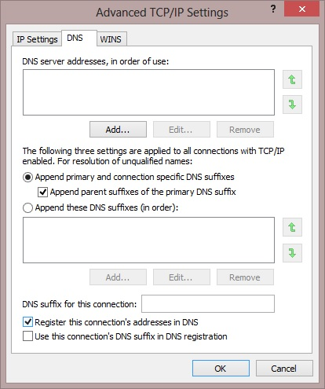

There are numerous reasons why DNS is amazing, it makes it a hell of a lot easier to navigate IP devices, it's one tool to make your data centre flexible and elastic and is friendly to the eye (for those whom English is fluent). But in some instances we want to prevent DNS usage. Recently when setting up some end points in a iSCSI network I didn't want the iSCSI adapter to register in DNS (with the idea to minimize any usage of the adapter except for iSCSI traffic).

Most will know there is a way to disable registration dynamic DNS registration through the GUI; open the properties of the network adapter of choice, followed by the IPv4 protocol properties, then advanced and lastly the DNS tab. It is here you will find the check box for **Register this connection's addresses in DNS**.

Simply un-tick and the adapter _should_ stop registering in DNS. _Should_ being the key word. Time after time I have found this check box does diddly squat.

In our time of need we turn to the one stop shop of the Windows Operating System, the Registry.

Open up the registry and go to the following key **HKLM\SYSTEM\CurrentControlSet\Services\Tcpip\Parameters\Interfaces\\_guidofadapter_**. Once you have found the right adapter create a new **REG\_DWORD** with the name of **DisableDynamicUpdate** and set the **Value** to **1**.

No buggy GUI will keep us down fellow SysAdmin's.
