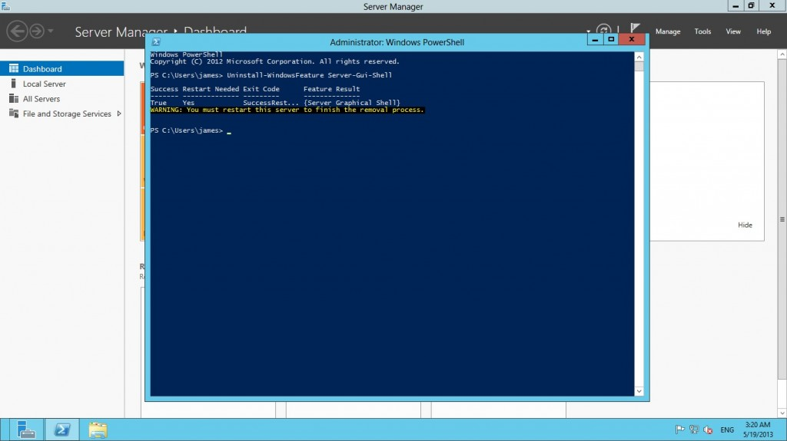
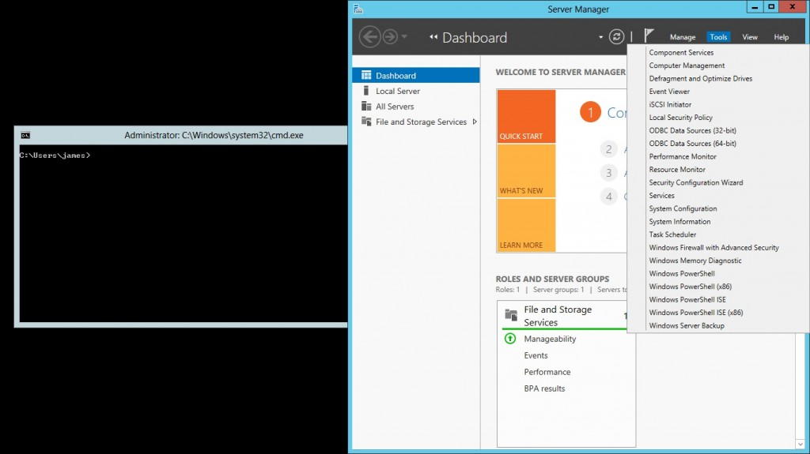
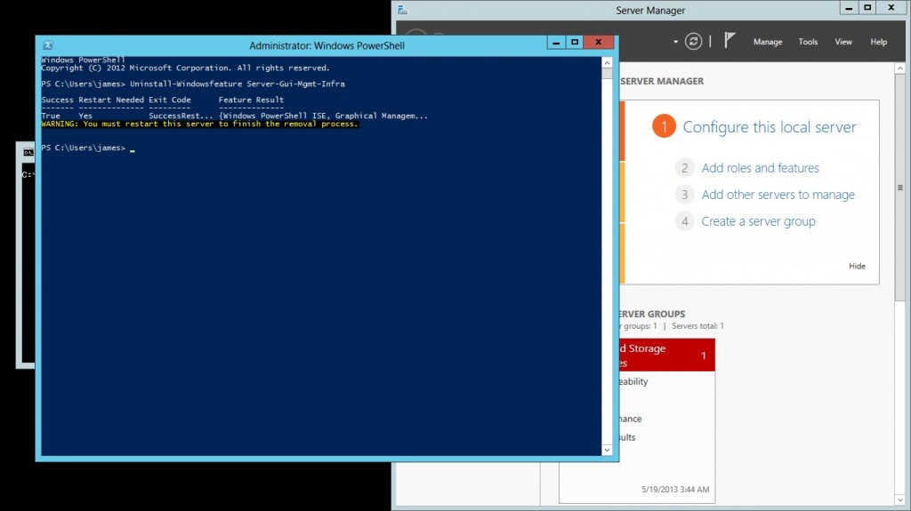
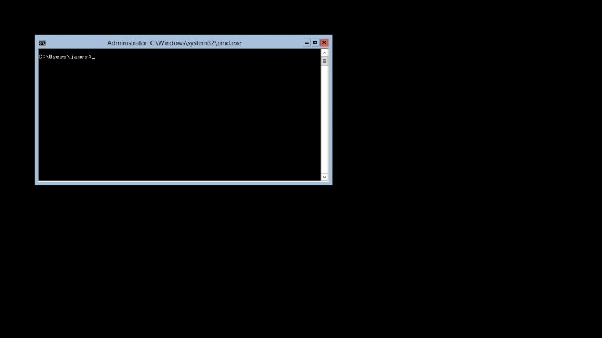

One of the much touted features of Microsoft's latest incarnation of the Windows Server release, Server 2012 is that administrators can freely switch between levels of interface available to the user.

In Server 2008 R2, the Server Core option was introduced which gave administrators all the power of the Window Server product without the bloat and attack vector of the GUI interface. Trouble was, this feature was permanent. This spelt trouble for those who didn't really know their way around Windows without the safety of Explorer.exe.

Thankfully, Microsoft have changed this in Server 2012 and now the GUI level can be changed freely via the Roles and Features wizard or via Powershell which I will demonstrate today.

Before we dive into how to change the levels of interface in Server 2012 let's explore the levels you can choose from:

### Server with GUI

This is the mode most will be familiar with. The typical Windows product with Windows Explorer, Internet Explorer and all the trimmings.

### Minimal Server Interface

This is a new addition in Server 2012. What we get is a very very nice in between mode where by all the typical binaries ala MMC, majority of Control Panel and even the Server Manager but minus the two most patched and vulnerable binaries in Windows; Windows Explorer and Internet Explorer.

### Server Core

The bare minimum; nothing but a Command Prompt here. If you like your servers lean and mean then pick this bad boy. This type of configuration would be a favourite among those already running Linux servers and enjoy management via shell and remote management tools.

Now that we now what we are dealing with let's go and reduce a **Server with GUI** to a **Minimal Server Interface**.

Drop down to Powershell and input the following cmdlet:

```powershell
Uninstall-WindowsFeature Server-Gui-Shell
```

[](http://dxpetti.com/blog/wp-content/uploads/2013/05/gui_to_minimal.jpg)

Once complete, we will be warned that a restart must take place to complete the install. For scripting purposes we can appended the above powershell cmdlet with **\-restart** to restart the machine after the GUI interface has been removed automatically if you so desire.

Now that we have restarted the machine we are presented with the a Minimal Server Interface configuration of Window Server 2012.

[](http://dxpetti.com/blog/wp-content/uploads/2013/05/minimal.jpg)

As you can see, upon login we are presented with a command prompt and Server Manager which has access to a wide array of applications available in Control Panel. Importantly, via Computer Management application we can still use Device Manager. This is pretty big in my view as most struggle with device driver management in Server Core installations. Having access to Device Manager _(in both read and write mode)_ would remove this boundary to running lean and mean server installations.

Let's take it one step further and remove all GUI components and reduce our **Minimal Server Interface** to a **Server Core** installation.

Once again, open up Powershell and input the following:

```powershell
Uninstall-Windowsfeature Server-Gui-Mgmt-Infra
```

[](http://dxpetti.com/blog/wp-content/uploads/2013/05/minimal_to_servercore.jpg)

Removal of the rest of the interface requires a restart just like the previous cmdlet so when you are comfortable, go ahead and restart the machine.

As expected, after restart we have ourselves a Server Core installation.

[](http://dxpetti.com/blog/wp-content/uploads/2013/05/servercore.jpg)

Nothing but a command prompt.

If you wanted to do the reverse, simply use the same cmdlet but instead of **Uninstall-Windowsfeature** use **Install-Windowsfeature**. You can install multiple features at a time, simply separate each feature by a comma.

For example if you wanted to go from a Server Core installation back up to a Server with GUI then use the following cmdlet:

```powershell
Install-WindowsFeature Server-GUI-Mgmt-Infra,Server-Gui-Shell
```

Easy huh?

If you don't need the full GUI experience then I strongly suggest making use of the **Server Core** setup. If that is too hardcore then the **Minimal Server Interface** is a great in-between with the best of both worlds.
