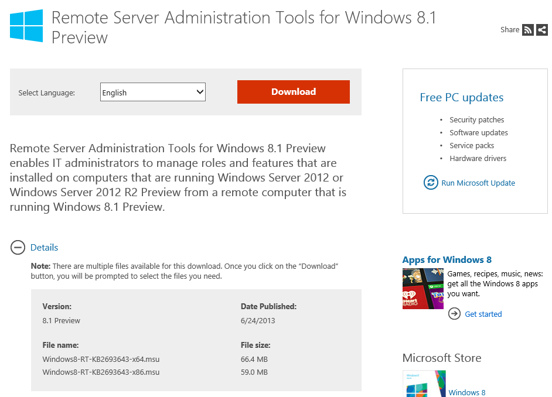

In a rather strange move by Microsoft, the Remote Server Administration Tools (commonly known as RSAT) for the upcoming Windows 8.1 **Preview** has been released for public consumption.

Head to [http://www.microsoft.com/en-us/download/details.aspx?id=39296](http://www.microsoft.com/en-us/download/details.aspx?id=39296) and grab the tools needed to remotely administer 2012 and 2012 R2 editions of Windows Servers.

Going off the file name, does that mean these tools will work on a Windows 8.1 RT machine too? Thin, light and cheap SysAdmin tool anyone?

Regardless, I for one welcome this very efficient Microsoft overlord.
