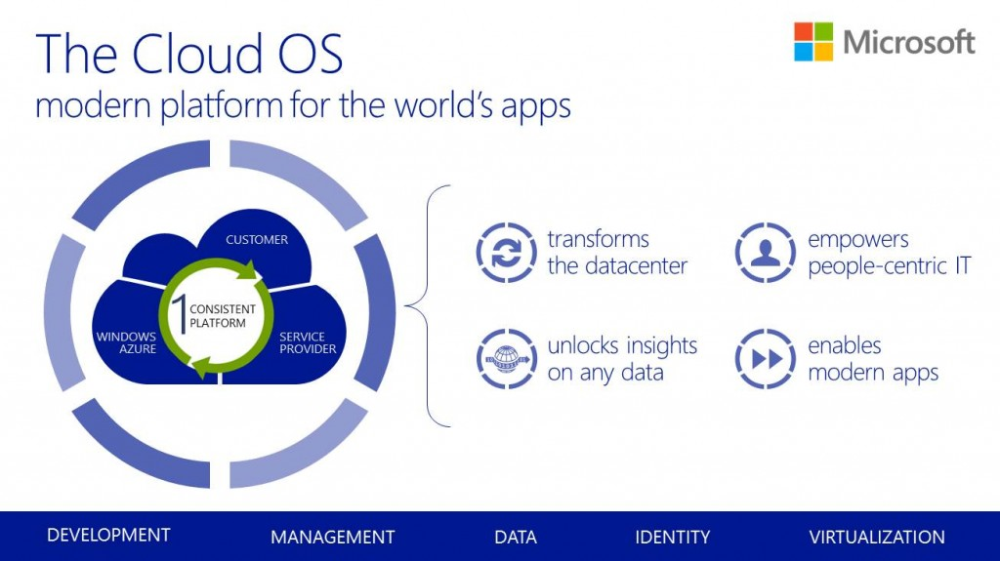

It's a fantastic time in tech circles at the moment. Cisco Live US is hussling and bussling in Orlando, Florida since yesterday. Microsoft's BUILD will be happening in two days time but more importantly (for Microsoft users) TechEd '13 Europe is on as we speak.

The focus for #TEE13 is (as you can probably guess) is on the Cloud, more specially, System Centre 2012 R2, Windows Server 2012 R2 and Windows Azure. Microsoft are calling these products collectively (wait for it) Cloud OS.

If you have a passion for these products and want to find out what is the word on the latest from Microsoft head on over to their [Virtual Pressroom](http://www.microsoft.com/en-us/news/events/teched/?WT.mc_id=Social_TW_OutgoingEvents_20130625_25205_windowsserver "Microsoft TechEd Virtual Pressroom") or join the conversation on Twitter by following the hashtag #TEE13

[Tweets about "#tee13"](https://twitter.com/search?q=%23tee13) 

I'm excited for all the virtualization improvements to Hyper-V & Clustering as well as Windows 8.1 and the shift to focus back on enterprise clients. I will no doubt having future posts on Windows Server 2012 R2.

If you would like try out Microsoft's Cloud OS products they can be downloaded [here](http://technet.microsoft.com/en-US/evalcenter/dn205292?WT.mc_id=Blog_SC_TEE_CloudOS "TechNet Evaluation Center")
