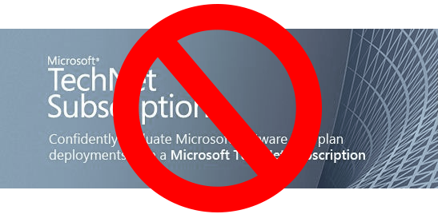

If you haven't heard the news already, Microsoft have made the decision to [retire the TechNet Subscriptions](http://technet.microsoft.com/subscriptions/ms772427 "TechNet Subscriptions - Help") service. Citing _evolving IT trends and business dynamics_, Microsoft doesn't think TechNet subscriptions fits very well in their strategy going forward and has instead pointing anyone wanting to test or evaluate Microsoft software to their gimped versions available through the [TechNet Evaluation Centre](http://technet.microsoft.com/evalcenter/ "TechNet Evaluation Centre").

The TechNet subscription service (for those who are unaware) gives anyone willing to shell out $300+ a year access to all current (and limited past) Microsoft software for the purpose of testing and evaluation. This is perfect for us fellow SysAdmin's who are passionate about their craft to build home labs and hone not just their skills but familiarise themselves with new and upcoming software and not imposed by any time limit or restrictions. I can attest that this is the single reason many of the VMs at my workplace are running Server 2012 is because of all the testing and prodding I was able to do in my home lab.

So this news is a big kick in the guts to me. I don't always have the time to sit down and dedicated to learning new software and like most people, my passion cannot be just turned on and off like a light switch so being restricted to 90 days is absolute crap. Yes, I do realise there is the [Microsoft Virtual Labs](http://technet.microsoft.com/en-us/virtuallabs/ "Microsoft Virtual Labs") & [Academy](http://www.microsoftvirtualacademy.com/ "Microsoft Virtual Academy") but both are very much a controlled and condensed version of the real thing. Virtual Labs are 90 minutes only _(you can hit a button to extend)_ and the Academy is straight up and down lessons. Neither allow any sort of freedom to tinker or replicate the environment you are after.

Let's face it, _evolving IT trends and business dynamics_ basically equates to piracy, lacklustre Windows 8, Windows Phone 7.5/8 and Surface sales and the ever growing race to the bottom against Linux and VMware with their Windows Server products. Balmer is under considerable pressure to tighten the straps and this move is a easy one to make. Why give out all your products to those who support them across the industry for a discount rate when you can restrict their access and ensure you can squeeze out a couple of more sales.

Not that all division's of Microsoft run under the same mantra but this line of thinking really irks of the Xbox One policies (that have now been reversed). Used game sales and sharing between peers have always be cited as why game prices are so high (and a massive loss of 'income' for game developers and publishers alike). It was only recently that the down sizing of available product keys per TechNet subscription stirred many up so in hindsight, we really should have seen this coming.

Let's not forget how Microsoft is moving to a year upgrade cycle for all of its Windows products as well...

It's rather sad though, SysAdmin's and all IT Pro's have a big influence on purchasing decisions inside organisations and if they no longer have access to the latest and greatest to test against (90 days is not long enough to thoroughly test Line of Business applications, especially those of a legacy variety), what incentive is there to upgrade? It only further enhance the risk that businesses does not often like to make when pondering whether or not to upgrade their ICT infrastructure (how many businesses have stated they will skip Windows 8? I cannot imagine they will enjoy Windows 8.1 anymore).

It wasn't that long ago when we all considering Microsoft reborn. WIndows 7 and Windows 2008 R2 was a MASSIVE turn around for the business. Maybe the pressure has finally gotten to Microsoft? All the articles touting Windows 8 as a failure...all the key personal who have step down, aside or jumped ship entirely...the shift from enterprise to consumer...cracks are beginning to appear; not in their products, but in their delivery.
