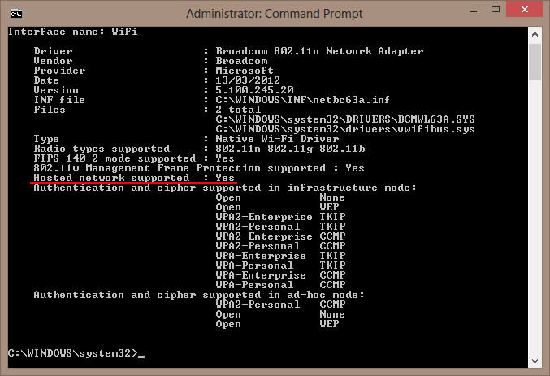

I only discovered this less than a fortnight ago but Microsoft in their wisdom removed the GUI option to setup a wireless hotspot (or Ad Hoc network) in Windows 8. I cannot think of any logical reason for them to do so (if you can please leave a comment). Maybe it is some conspiracy with Hotel's so enterprising people like myself don't pay for in-room WiFi and just use our computers to provide hotspots for our collection of connected devices.

But enterprising people like myself always find a way.

First thing we must do is check to see if your wireless network adapter is capable of network virtualization (9/10 this shouldn't be an issue but it helps to check). Drop down to a administrative command prompt and type the following:

```cmd
netsh wlan show drivers
```

With any luck next to **Hosted Network Supported** we should see a **Yes**. For example:



Now we can proceed with the nitty gritty. Let's create the wireless hotspot with the following command (once again, in a administrative command prompt):

```cmd
netsh wlan set hostednetwork mode=allow ssid=networkname key=networkpassword
```

Just replace the ```networkname``` with a name for the network and ```networkpassword``` with a (complex) password.

With the network created we can now start it up. Input the following command (yep, still an administrative command prompt) to fire up your wireless hotspot:

```cmd
netsh wlan start hostednetwork
```

Now your network will be visible and you can connect to it and enjoy internet for ALL THE THINGS. Except...there is one last little step. We must tell Windows that we allow our wireless adapter to be shared with other devices for the purpose of internet connections. Go to the **Network & Sharing Centre** in **Control Panel**, followed by **Change adapter settings** and go to the properties of your network adapter that is currently connected to your internet connection. Next, click on the **Sharing** tab, followed by ticking the box that states **Allow other network users to connect through this computer's Internet connection** and selecting the newly created wireless hotspot (typically named **Local Area Connection\* xx** where _xx_ is a automatically assigned number).

Now we should be receiving the internet connection through our newly created wireless hotspot.

There is one caveat to this, if your computer goes to sleep or is shutdown, the connection will be closed and the above process (minus the last step) will need to be repeated. If you plan on using this feature heavily I suggest creating a batch file with the above ```netsh``` commands to automate the process.

Happy internet sharing!
