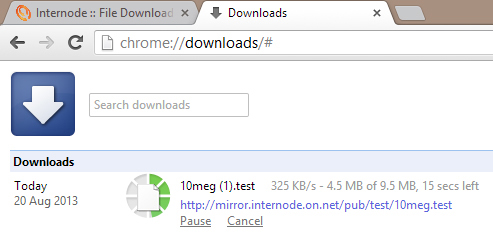

Like most people, I don't have the perfect network setup at home. My main desktop computer (which usage declines year on year), server, modem/router/switch/access point combo box sits at one end of the house while the lounge, dining and outdoor deck sits at the other end of the house. In the era of mobile devices I tend to do more of my computing at the comfy end of the house (especially in winter when the fireplace is used). This can get frustrating at the best of times. The WiFi signal bounces between 1 and 0 bars and results in me either giving up or simply moving closer to the other end of the house. [Visit boostpoorsignal.com](https://boostpoorsignal.com/) to learn some easy steps to boost poor signal strength.

The problem could be easily solved by a second AP, some running of CAT5e/6 cabling back to the combo box. Unfortunately this home is not my own, I just live here. So, I more or less just put up with it, tweak 2.4ghz spectrum channels, reposition the combo box in different ways to little or no effect.

The other week though, I had enough. I thought, in this day and age I expect a little more from my home network and it was time to resolve this problem. But the question was how?

The answer came to me in a dream...actually no, I simply remembered back to a technology I more or less dismissed at its inception and thought it was worth a second look.

HomePlugAV, Powerline, IEEE 1901, Ethernet over Power (EoP), what ever you want to call it, defines high speed communications and networks over traditional power lines.

_Enter the **Netcomm NP206 Wireless Powerline Kit**_

The Netcomm NP206 Wireless Powerline Kit contains the following:

- 1x Powerline Adapter with AC Pass-through
    - Intellon INT6400 (Powerline chipset)
- 1x Powerline Adapter with 802.11n
    - Intellon INT6400 (Powerline chipset)
    - Ralink RT3052 (802.11n chipset)
- 2x Ethernet Cables
- 1x Quick Start Guide
- 1x Product Warranty

Disappointingly, the Ralink RT3052 is quite an old 802.11n AP/Router SoC that dates back all the way to 2008 and thus is single band, 2.4GHz only. On the flip side, only one of my devices in my collection is dual band and the density of devices nor spectrum congestion is an issue where I live.

Once unboxed, setup is rather painless. Netcomm have already pre-paired the adapters together in a powerline network (this is separate to a traditional data network) and all you  have to do is simply plug them both in and connect the single Ethernet over Power adapter one to your combo box via the supplied (x2) Ethernet cable.

The result is I had a new SSID pumping out at full strength in our lounge room which is connected to my existing data network.

_Great,_ but I wasn't done.

Like any IT Professional would, I wanted roaming WiFi. A quick visit to the Netcomm website, [grab and install their utility](http://media.netcomm.com.au/public/assets/file/0019/101809/NP202WN.zip "Netcomm NP202Wn Utility"), connect the computer to the Wireless Access Point/Ethernet over Power adapter via Ethernet and fire up the utility to change the SSID.

Now that I am back to a single SSID WiFi network, what about the results? Well apart from having plenty of signal, I performed some brief and not overly scientific tests to get a basic idea of the difference the NP206 kit made.

First, I established a base line featuring the bandwith available (according to Windows 8 and Android 4.3 phone), downloading a 10mb test file from my ISPs file mirror and copying said 10mb test file to my server (Windows 2012 R2 Preview w/ single Gigabit Ethernet connected) over the WiFi.


  
  
  
  


And now doing the same tests after the installation of the NP206 kit.


  
  
  
  


There you have it; better results all round.

While the Netcomm NP206 hasn't provided me with absolutely killer wireless speeds (this particular kits powerline network bandwidth tops out at a theoretical 200mbps compared to the theoretical 300mbps bandwidth of 802.11n), it has done exactly what I asked it to; significantly improve the WiFi in an area of our house.

Companies such as [Milsoft Utility Solutions](https://www.milsoft.com/) is giving electric utility personnel the tools they need to model and analyze the electric distribution network so that they can plan, operate and manage the system at minimum capital and operating costs.

I certainly think there is a application for powerline networking gear. It will be more or less restricted to consumer's homes but that is where it's strength lies. It is perfect for those who don't (or cannot) go around digging into their walls and threading networking cabling between cobwebs and structural beams. Let's be honest... powerline kits certainly will out perform WiFi repeaters.
