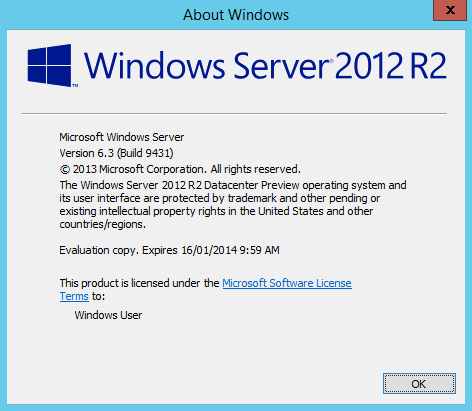

If you have been hanging out for the latest release of Windows for either your home computer or your server farms the wait is almost over.

Microsoft have _set the date_, October 18th (for those in Australia & NZ, 17th for those in the States and everywhere else) for the general release. Please note, RTM availability is usually before general availability, so for those of us with the [dead man walking TechNet subscriptions]() expect downloads to be made available earlier.

Windows 8.1 (as well as RT), despite Microsoft ditching the traditional release followed by several service packs cycle, will be released for free for those who already own Windows 8.

Windows Server 2012 R2 will be released through traditional channels and feature along side refreshed versions of System Center and Windows Intune as part of the dubbed R2 wave update.

Discover more about the [Windows 8.1 release here](http://blogs.windows.com/windows/b/bloggingwindows/archive/2013/08/14/mark-your-calendars-for-windows-8-1.aspx "Mark your calendars for Windows 8.1!") and the [2012 R2 here](http://blogs.technet.com/b/in_the_cloud/archive/2013/08/14/mark-your-calendars-for-oct-18-the-r2-wave-is-coming.aspx "Mark Your Calendars for Oct. 18: The R2 Wave is Coming!")
