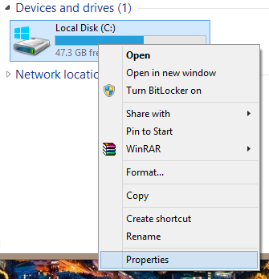
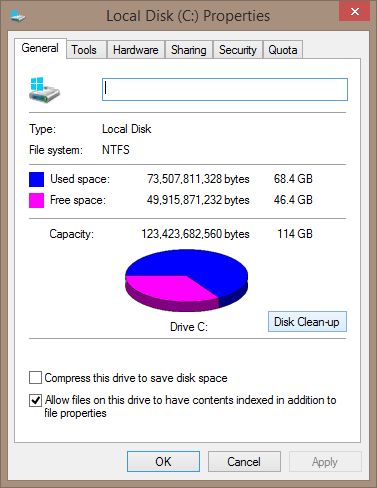
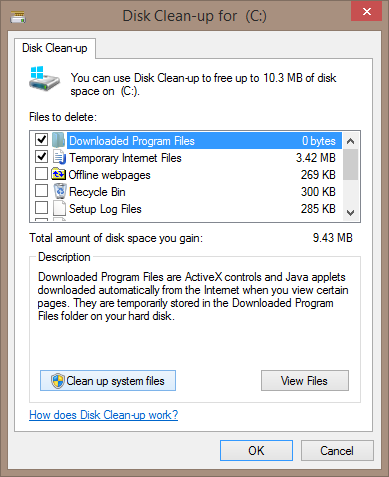
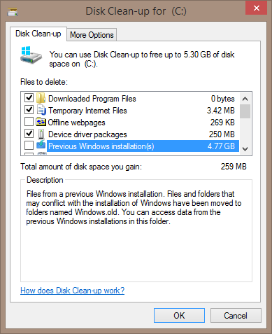
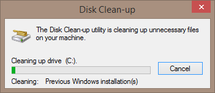

One of the handy things about performing a in-place upgrade Windows versus a wipe/install upgrade is the option to rollback to your old copy of Windows if things didn't turn out the way you like.

This convenience though does come at the cost of disk space. Those who use a highly mobile tablet machine with storage space on the small side or those who are using a SSD know the importance of getting rid of anything unnecessary to maximize disk space.

Fortunately, Windows (for a long time now) provides a not immediately visible way to cleanly remove the old copy of Windows. So provided you are happy with your shiny new copy, lets do a clean up!

Firstly, open up **File Explorer** and right-click your system disk (typically disk C:) and click **Properties**.

In the system disk properties, click **Disk Clean-up**.

Next, click on **Clean up system files** button (from here on will require Administrative privileges).

In the new window tick the **Previous Windows installation(s)** option (deselect the other tick boxes if you only want to clean up the old copy of Windows) and click **OK**.

Finally the clean-up will be on its way and disk space will be returned to you.

As you can see from the **Clean up system files** window, the space regain is considerable (nearly 5GB in my case). Definitely worth it, especially if you have no intention of returning to the old build of Windows.
