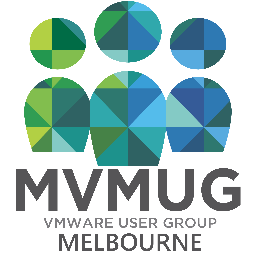

Last November my dear friend [@Pandom_](https://twitter.com/pandom_) presented at the Melbourne VMUG (or MVMUG) event and asked me to tag along for the ride. 

VMUG, being VMware's community outreach program that bridges the gap between the users (or anyone interested) and the vendor itself. Contrary to what you might think, VMUG is run by the users themselves and receives the backing not only from VMware, but many other vendors such as Symantec, Dell, Puppet Labs, PRTG Network Monitor, Veeam etc.. provide sponsorship to the events. The events come in a multitude of varieties, ranging from User Group Meetings, (Online) Virtual Training and the big User Conferences (think TechEd style but without a huge price tag).

Not sure what to expect I agreed to check it out and see what all the fuss was about. 

I was pleasantly surprised to see how friendly, open, transparent and playful (while being professional) the whole event turned out to be. The room was packed with people from all walks of life. Not simply a room full of VMware diehards and server administrators/engineers; network administrators/engineers, sales consultants, managers from multiple disciplines among others were well represented. I guess the first lesson I took out of MVMUG was that anyone is welcome. Even a _Microsoftee_ like myself...



This particular MVMUG event contained a talk on Storage tips across VMware products, a deep-dive session on the new network virtualization product VMware NSX, both of which were presented by technical folks from VMware. These talks generated a lot of healthy discussion and debate, all in the name of a better product for the users. Everything was taken on board, everything was on the table and there was no to hiding and hushing from VMware representatives. This was no sales pitch folks, this was true passion for IT and it was allowed to foster and grow transparently. 

Finally a community-led talk from [@Pandom](https://twitter.com/pandom_) on _Building Networks That Supported Vertical Growth_, a talk that while centred around technical details, did not ignore the political side of IT and how to best show management why we do what we do. Laced with internet memes galore, the talk drew plenty of laughs, applause and was a great way to finish the event.

To close out the night, everyone who attended is welcomed to join fellow attendees at a local bar for vBeers. Luckily, the beers are indeed physical.

My final thoughts on my experience on my first VMUG event could be summed up as the following:

_**Community Education Passion**_

If you are interested in virtualization, of any kind, I highly recommend you head on over to http://www.vmug.com/p/cm/ld/fid=140, find your local VMUG group and get active. Say hi to the members, make friends, join in on the next event and drink plenty of vBeers (don't drink and drive folks).
