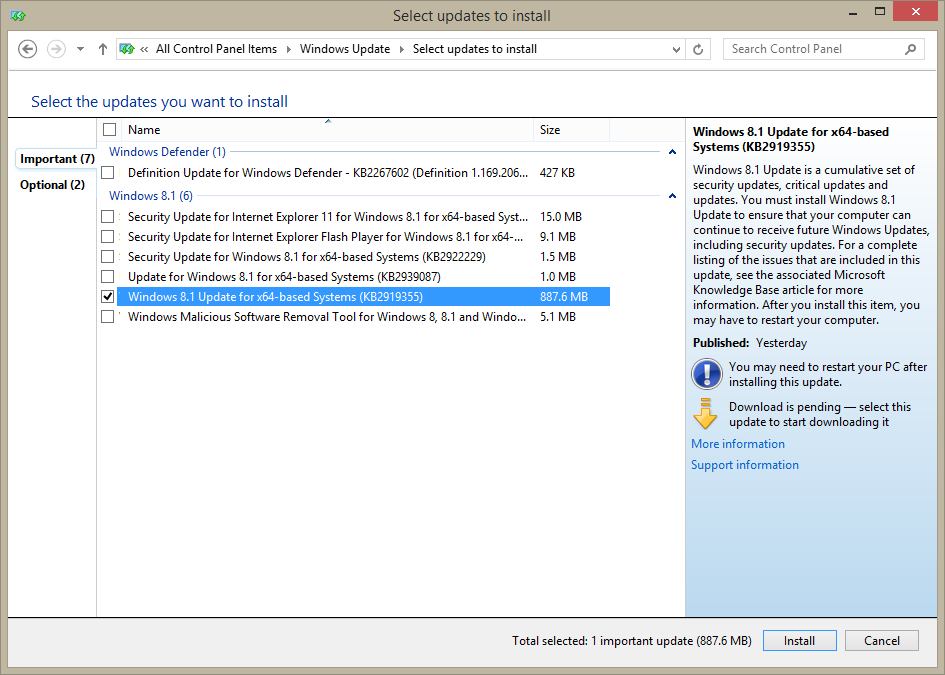
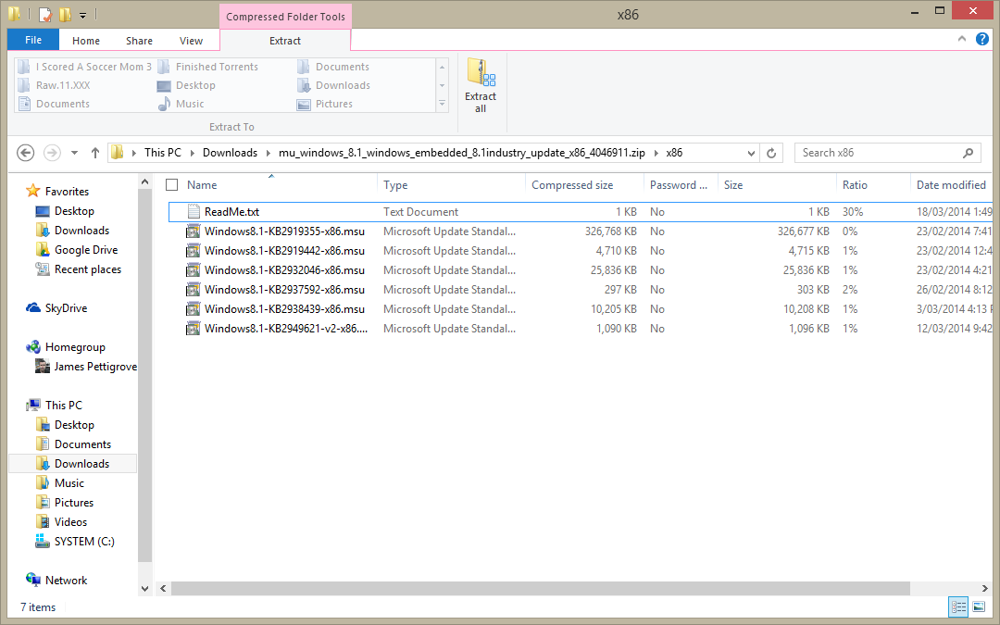

As I [blogged about earlier](), Windows 8.1 Update 1 was leaked very well ahead of schedule. Despite efforts by Microsoft to plug the holes, it was far too late and many got their hands on the unreleased and much lauded update.

Now the time (April 8th) has come for the update to be launched properly. If you head on over to Windows Update on your machine, with any luck, you should see an update entitled **Windows 8.1 Update for x64-based Systems (KB2919355)** as pictured below

Microsoft describes the update as:

> - Enables a more familiar mouse and keyboard functionality for modern apps and controls.
>    
> - Improves the web application compatibility of the Internet Explorer 8 emulation mode in Internet Explorer 11 F12 Developer Tools.
>    
> - Increases performance and reliability when you use multi-display configurations for portrait-first device experiences.
    

Even though the update is provided as a single MU file via Windows Update, there are in fact multiple MU files contained within this update. If we inspect the update provided via TechNet, we can see multiple different KB MU files and even a readme.txt file which suggests a installation order for each update file.

This is reminiscent of what we saw earlier in the leaked version and suggests not much (if anything) has changed since.

The update is a mandatory update going forward and users will require it installed to receive future updates.

Further information on the update can be found [here](http://support.microsoft.com/kb/2919355/en-us "Windows RT 8.1, Windows 8.1, and Windows Server 2012 R2 Update April, 2014").

If you would prefer to get the update in zip form and not through Windows Update and have a TechNet account, you can download the MU file [here](https://technet.microsoft.com/en-us/subscriptions/securedownloads/hh442904#searchTerm=&ProductFamilyId=542&Languages=en&PageSize=10&PageIndex=0&FileId=0 "Windows 8.1 Update 1") or for Server 2012 R2 [here](https://technet.microsoft.com/en-us/subscriptions/securedownloads/hh442904#searchTerm=&ProductFamilyId=542&Languages=en&PageSize=10&PageIndex=0&FileId=0 "Windows Server 2012 R2 Update 1").

Enjoy
