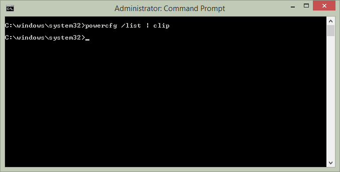
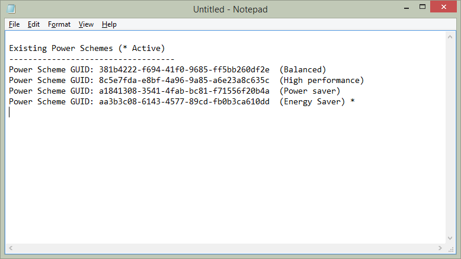

Piping output of applications is nothing new to those in the profession of IT (especially the \*nix administrators out there) but there was a feature added to Windows 7/Server 2008 R2 that doesn't seem to be widespread.

Any command that you enter at the Command Line prompt or CMD as we all know it as can be piped to the Windows clipboard with a simple argument. All you need to do is at _| clip_ to your command.

For example, let's pipe a list of power plans using powercfg to the clipboard:

```cmd
powercfg /list | clip
```

The output of this looks like the below:



Notice how there is...no output.

Now let's head into notepad and paste what is on the clipboard:



Hey presto, all the output from the command that would have displayed at the CMD prompt was piped into the clipboard and now into whatever output of your choosing (in this case, Notepad).

Fellow SysAdmin's know what to do


[_Cheers to fellow redditors for the find_](http://www.reddit.com/r/windows/comments/2dz6os/til_you_can_push_windows_cmd_prompt_output_to_the/)
