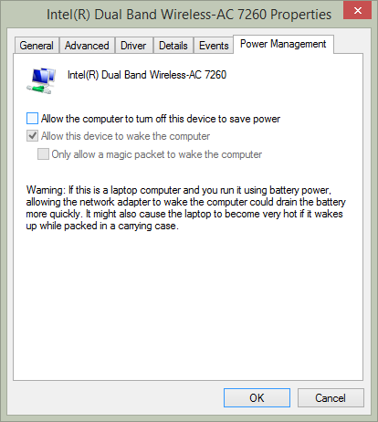

I recently updating Windows and all the Lenovo software & drivers and have run into a very annoying issue. Whenever my notebook is put to sleep, upon resume the wifi isn't automatically connected to my home network. If I try manually connecting I get the very descriptive "Cannot connect to this network" message. Only a disable of the network adapter and enable allows the wifi to connect back to the home network.

This issue isn't new to me. It happened at one stage on my previous HP Folio 13 notebook when it was on Windows 8 (and subsequently, 8.1)

I tried a number of things ranging from forgetting the wireless network, recreating the network profile to telling it to connect even if the SSID isn't visible. Nothing worked. My last resort would have to be a rollback of the driver but even that wouldn't guarantee a result. Lucky for me I managed to find a fix.

The problem comes down to Power Management.

For whatever reason in Windows 8.1, once the notebook is put to sleep the network adapter fails to wake again until you give it a jump start.

To side step this problem, simply prevent Windows from controlling the power of the device and leave it to the trusty BIOS and other hardware based management.

This is achieved by going to the **Network & Sharing Center** > **Change Adapter Settings** > right-click on your wireless adapter and select **Properties** > **Configure** > **Power Management** and uncheck the box next to **Allow the computer to turn off this device to save power** like below:

Now the state of the wireless adapter's power is outside the bounds of Windows and the wake/reconnect issue will stop.

Give it a go if you are having similar issues and drop me a line if it help you.
