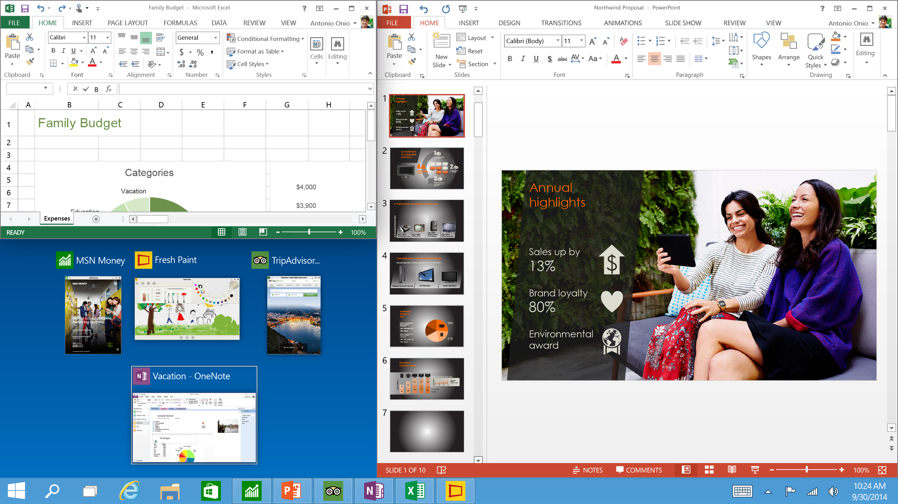
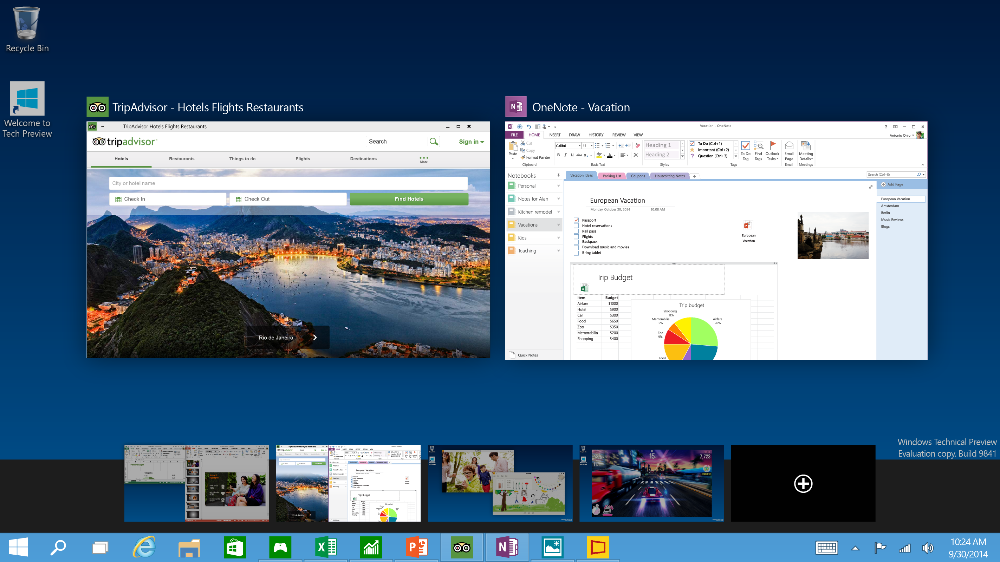

Yes that's right folks, before Windows 9 could change your mind about the modern Windows it has been taken out the back and shot; Introducing Windows 10.

![Windows_Product_Family_9-30-Event-741x416[1]](images/Windows_Product_Family_9-30-Event-741x4161.png)

At one stage under the guise of Windows Threshold, Windows 10 promises to be the one Windows across all devices; what Windows 8 was meant to be. From Internet of Things devices (hello Galileo), smart phones and tablets right up to notebooks, desktops, Xbox's and servers.

On that note, nothing has been said whether we will see Windows Server 10 (2015?) or the server side will truly fall under the one banner along with the other consumer versions.

Microsoft have talked the talked and named the enterprise customers as their key target for Windows 10, which is probably why [the whole current and future System Center suites will be able to support devices with Windows 10](http://blogs.technet.com/b/configmgrteam/archive/2014/09/30/windows-10-enterprise-management-with-sc-configmgr-and-intune.aspx "Windows 10 enterprise management with System Center Configuration Manager and Intune").

_'Continuum'_ promises to make Windows 10 flexible when using multiple different inputs such as the traditional keyboard & mouse and touch and ease the transition between the two.

But what else can be expected from Windows 10? So far Microsoft have demonstrated the following:

_")

Pictures are never enough, so preview the above in motion as demonstrated by Microsoft's Joe Belfiore



If that wasn't enough, you can watch the media brief, in its entirety below



Excited? Keen? Then keep your eye on [http://preview.windows.com/](http://preview.windows.com/ "Windows Insider Program") for the opportunity to access the preview of Windows 10.
