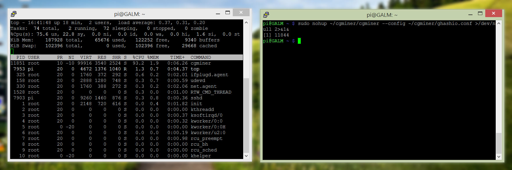

In a [previous post](), we covered how to setup your Raspberry Pi with cgminer along with some USB ASIC mining hardware.

So now that we have cgminer working just the way we want to, why not go one step further and run cgminer as a background process (i.e. a service) so even if you close your session your miners will continue to hum away at those hashes? The beauty about Linux is any process can be sent into the background using a combination of ```nohup``` and ```>/dev/null 2>&1&``` as below

```bash
sudo nohup ./cgminer --config /path/to/config.conf >/dev/null 2>&1&
```

Let's break this down so we know exactly what is going on;

```bash
nohup
```

will block any command from receiving the hangup signal which is sent out to all processes in a shell upon termination (say, when you log out)

```bash
>/dev/null
```

will send any standard output from the command to the blackhole known as **/dev/null**

```bash
2>&1
```

will send any standard output errors (so any errors) to standard output, which is going to **/dev/null**

```bash
&
```

will run the command as a child process of your current session

Easy right? .....mmmmm no

Due to the nature of cgminer and the interface it outputs, sending the output to **/dev/null** makes it go all crazy on the Raspberry Pi's CPU.

Go ahead and run the following to check the processes running on your Pi

```bash
top
```

You will most likely experience something like the below:



Check out that cpu usage by cgminer... **93.2%**

It won't be long before your poor Pi is crying in agony (passively cooled and stressed is not a combination I would want to occur for any stretch of time)

Let's stop cgminer by taking note of the number under the **PID** column for cgminer and running the following

```bash
sudo kill replacewithpid
```

or in my instance

```bash
sudo kill 11851
```

Now that our Pi is back to normal let's try making cgminer a background process once more but with a couple of extras added in

```bash
sudo nohup ./cgminer --compact --real-quiet --config /path/to/config.conf >/dev/null 2>&1&
```

```--compact``` removes the mining device statistics

```--real-quiet``` disable's all output (not strictly true, but close enough)

If we check with **top** once more you will find cgminer happily ticking away at around 10% CPU usage. Much more bearable.

Tune in to the [final part]() where we will turn that background process into one that autostart's with your Raspberry Pi
