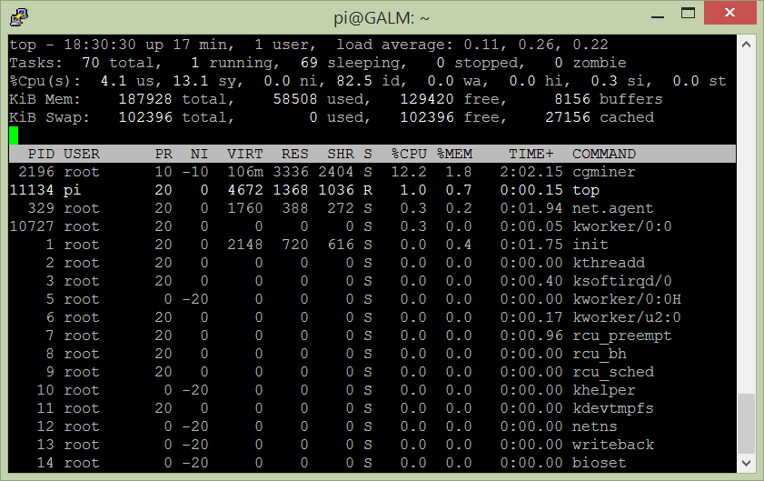

Continuing on from the good work we have achieved thus far in [Part 1]() & [Part 2](), we are going to complete our Bitcoin Mining journey by making our Raspberry Pi start mining as soon as it is powered on.

We previously had the following command to start the cgminer application as a background process (i.e. a service)

```bash
sudo nohup ./cgminer --compact --real-quiet --config /path/to/config.conf >/dev/null 2>&1&
```

Now, we are going to take that command, change it up one final time and have it run upon startup.

First, lets open up **rc.local** file, which contains startup commands with ```nano``` by doing the following

```bash
sudo nano /etc/rc.local
```

Next, create some space above this line

```bash
exit 0
```

In this space, we will put in our cgminer as a background process command with a few changes below

```bash
nohup /home/pi/cgminer/cgminer --compact --real-quiet --config /home/pi/path/to/config.conf >/dev/null 2>&1&
```

So what's changed?

Firstly, we have removed the use of ```sudo``` which elevates us to an administrator. Anything ran from the rc.local file will be run by the root user and thus there is no need for sudo.

Secondly, we have changed the path of both **cgminer** and the config file so that it is the full path. Previously we made use of the **~** character which is shorthand for the current users home directory. Once again, this isn't relevant to the root user as we git cloned cgminer to the home directory of our standard user on the Raspberry Pi, which is **pi**. All home directories in Raspbian are located under **/home/** and thus the full path to any folders or files located in our home directory is **/home/pi/**

Once you have successfully edited the file in nano, hit ```CTRL-X``` followed by ```y``` to exit and save the file.

Now you can restart your Raspberry Pi to test. To do so from the command line punch in

```bash
sudo shutdown -r now
```

After the restart, check the running processes/services with the ```top``` command



If you got your paths correct you will see cgminer ticking away.

That's it. Thanks for following along on journey of mining the cryptocurrency Bitcoin on the humble Raspberry Pi with USB ASIC mining hardware. Not only have we covered using cgminer but also vital parts of Linux such as the nohup command, top, kill as well as using the rc.local file.

Chime in below with your results or if you have any other suggestions for a Raspberry Pi project!
