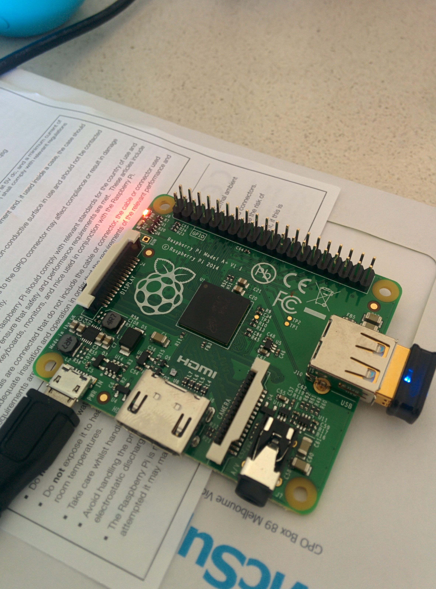

Christmas brought me a very special gift in the form of a Raspberry Pi A+

For those unaware, the Raspberry Pi A+ packs the following into a credit card sized PCB:

>  700MHz Broadcom BCM2835 CPU  
>  256MB RAM  
>  40pin extended GPIO  
>  1 x USB 2 port  
>  4 pole Stereo output and Composite video port  
>  Full size HDMI  
>  CSI camera port  
>  DSI display port  
>  4 mounting holes  
>  Micro SD port  
>  Micro USB power connector  
>  Size : 65mm x 56mm

Already done quite a number of different things with my Pi from purely software related to interacting with Bitcoin ASIC miners via USB and even controlling LEDs, buzzers and reading temperature via the General Purpose Input Output (GPIO) pins.

I never expected to be interested in hardware based tinkering but my time in Hong Kong where I was able to get down and dirty with soldering, learning about microprocessors and other components as well as the multitude of applications for the hardware we were using (real time mapping of seismic activity, analysing recovering of veterans etc...) really sparked something for me. Let's also not forget the buzzword of current times is Internet of Things (IoT) and the Pi fits right in there.

Expect many more posts surrounding my time with the Raspberry Pi in the very near future.
