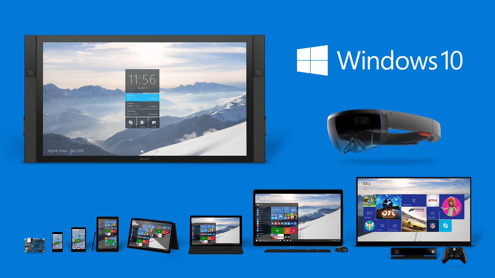

To the joy of many clinging on to their Windows 7 machines, the next genereration of Windows, Windows 10 will be made available for the first year as a **free upgrade to those using Windows 7, Windows 8.1 and Windows Phone 8.1**.

As that last part suggest, Windows 10 will be the all encompassing operating system that Windows 8 was meant to me. Not just PCs, not just tablets, not just convertibles, not just mobiles and not just gaming consoles. Windows 10 will be available across a multitude of devices now common in homes and business alike.

Watch the ever-present VP of Windows Joe Belfiore run through the latest build of Windows 10



To find out more about the latest release of Windows, have a read of [The next generation of Windows: Windows 10](http://blogs.windows.com/bloggingwindows/2015/01/21/the-next-generation-of-windows-windows-10/ "The next generation of Windows: Windows 10")
