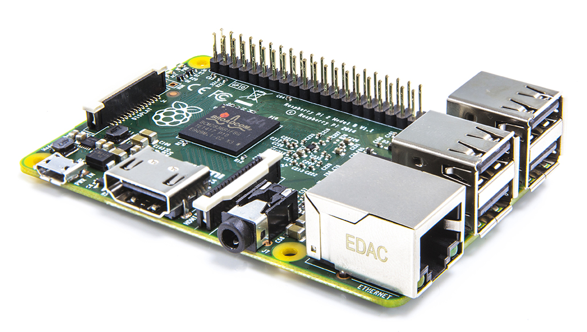
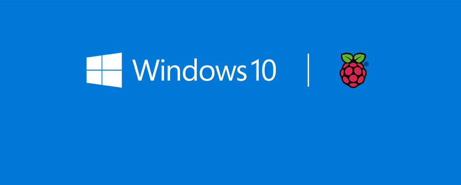

2017 is here, or that is what the Raspberry Pi Foundation is leading us to believe. That is the year that they forecasted the successor to the Raspberry Pi would arrive. It's not often in the ICT space that stuff happens on time but the Foundation has managed to bring forward the successor to the original Pi, aptly named the **Raspberry Pi 2**. 

## What's the same?

The Raspberry Pi 2 Model B contains the same 40 Pin GPIO layout as the current Model B+ and A+ (which extends the 26 Pin GPIO layout from the original and thus is identical up to the 26)th pin. The Pi 2 contains the same auxiliary ports as the Model B+ it replaces as well as the same shape (this will please case makers) and miraculously it is the same $35.

## What's new?

This is when it gets interesting. Plenty of critic's of the Raspberry Pi usually pinpoint on the performance of the ARM v6 Single Core CPU running @ 600MHz coupled with 256/512mb of RAM. They will now have to find something else to moan about because the Pi 2 is packing a ARM v7 Quad Core CPU running @ 900MHz matched with 1GB of RAM. Despite going up a architecture the chipset remains identical and thus current projects will have zero compatibility issues. Not to mention Linux kernel officially supports the ARM v7 architecture which means many many many more distributions will be able to run on the Pi 2. There is also one other operating system that the Pi 2 can run...

**Yep**

Crazy has happened. Microsoft and the Raspberry Pi Foundation have joined forces to ensure the Raspberry Pi 2 will run Windows 10.

It's not so outlandish as it first seems. Remember, [Microsoft worked with Intel to bring a very customised version of Windows to the Intel Galileo](https://msopentech.com/blog/2014/10/02/windows-on-intel-galileo-gen-2/ "Windows on Intel Galileo Gen 2") and I will personally admit I was very interested it the prospects it could bring. But after evaluating the costs and the distinct lack of community the device lacks (a problem that occurs for almost every Raspberry Pi competitor) I came to my sensors _(heh)_ and aimed for the Pi instead. Bare in mind, one of the objectives for Windows 10 is to be the one true everywhere operating system; cloud, on-premise server, desktop, mobile, gaming console, internet-of-everything devices; it would seem such a waste to throw away the hard work. 

Couple this with their [recent strategy to give away Visual Studio for free](http://blogs.msdn.com/b/somasegar/archive/2014/11/12/opening-up-visual-studio-and-net-to-every-developer-any-application-net-server-core-open-source-and-cross-platform-visual-studio-community-2013-and-preview-of-visual-studio-2015-and-net-2015.aspx "Opening up Visual Studio and .NET to Every Developer, Any Application: .NET Server Core open source and cross platform, Visual Studio Community 2013 and preview of Visual Studio 2015 and .NET 2015") and Microsoft, along with the Pi 2 have a very concise strategy to give a piece of the IoT pie and down the line, more people to their platforms and programming languages.

I'm very interested to see where this new partnership will take the Raspberry Pi. Will it divide the community that has built it self around open-source and languages such as Python or will it continue on as per normal given that their are multiple operating system's (Pidora, RISC etc...) as well as programming languages (ruby, scratch-gpio etc...) already in this big fish pond?

View the official Raspberry Pi Foundation blog post [here](http://www.raspberrypi.org/raspberry-pi-2-on-sale/ "Raspberry Pi 2 On Sale") and Microsoft's official blog post [here](http://dev.windows.com/en-us/featured/raspberrypi2support "Windows 10 for Raspberry Pi 2")
