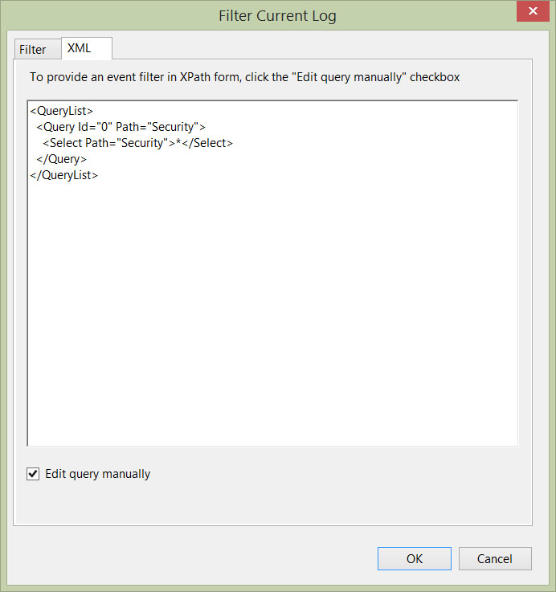

We've all been there when we are asked to find out if a certain user logged in to their computer (or logged off). If you have a Windows domain environment then this request isn't all that difficult to perform.

Log into the workstation as an administrator and launch Event Viewer (eventvwr.msc) or if enabled, launch Event Viewer from your workstation and use the **Connect to Another Computer** facility.

Once you have access to the logs of the target workstation, expand the **Windows Logs** and click on **Security**. After the Security log has been populated, click on **Filter Current Log...** option.

From the new window, we are presented with a number of options to filter our log; by Event Level, by Task Category, by Event Source etc... We are going to do away with this way and click on the **XML** tab. Go ahead and click the **Edit query manually** checkbox, click **Yes** to the prompt explaining once we go XML we can't go back and we are presented with a (mainly) blank canvas.

[](http://dxpetti.com/blog/wp-content/uploads/2015/02/filtereventlog.jpg)

Remove what is currently in the workspace, copy/paste the following XML in, replace the ```username``` with your chosen windows username _(keep the ' ')_ and click **OK:**

```xml
<QueryList>
  <Query Id="0" Path="Security">
    <Select Path="Security">
     *[System[(EventID='4624')]
     and
     EventData[Data[@Name='LogonType'] and (Data='2')]
     and
     EventData[Data[@Name='TargetUserName']='username']
     ]
    </Select>
  </Query>
</QueryList>
```

This will filter out all the security events except for the log in events.

If you want just log out events, paste the following XML in to the workspace instead:

```xml
<QueryList>
  <Query Id="0" Path="Security">
    <Select Path="Security">
     *[System[(EventID='4647')]
     and
     EventData[Data[@Name='TargetUserName']='username'] ]
    </Select>
  </Query>
</QueryList>
```

Once again, remember to replace the ```username``` field with the chosen username.

Not difficult at all right?

Now go forth and please HR
