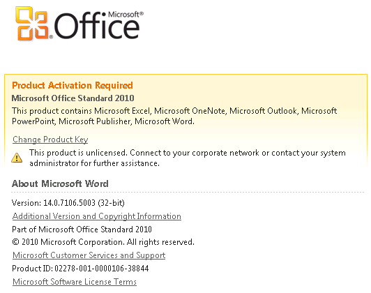

Centralised activation of software is a really fantastic and vital piece of infrastructure in a corporate IT environment. Gone are the days of needing to manually input keys for each instance of a software application of operating system.

Like anything, sometimes they don't quite work seamlessly as we hope. I am sure I am not the only one who has had a customer inquire about Microsoft Office annoyingly prompt them about activation like seen in the below image:



Normally such a issue will resolve itself; much like Group Policy, KMS (or Key Management Services) works at various intervals and is not constantly running. For that customer who doesn't want to wait around, there is a way to manually activate:

Firstly, open up a Command Prompt window and navigate to the activation script's location of _C:\Program Files\Microsoft Office\Office 14\\_

To check the Activation Status of Microsoft Office, run the following command.

```cmd
cscript ospp.vbs /dstatus
```

To re-run Activation of Microsoft Office, run the following command.

```cmd
cscript ospp.vbs /act
```

Providing your KMS infrastructure is working correctly then Office should now be successfully activated after a little nudge.

Happy days
