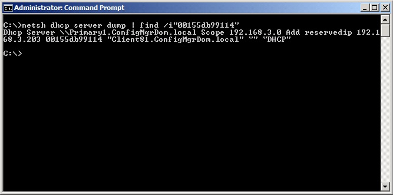

There comes a point when you ask yourself, 'there has to be a better way' (this should be often). This was certainly the case where after a large campus switch out which required many printers to be reconfigure. Part of that reconfiguring was creating new DHCP reservation.

Unfortunately, if you do not cull the old lease, Windows (rightfully so) informs you there is already a device with that MAC in the reservation database. In someone's at Microsoft's infinite wisdom, they neglect to tell you what DHCP scope the device is currently reserved in. So I would begin to trawl each scope I guessed in maybe reserved in based on my knowledge of our current scopes. This would waste many minutes of my time (sometimes without success) which means my customers are getting less of me. No good.

But, I did ask myself, 'there has to be a better way'...and there is!

Open up a command prompt window on your DHCP server (or a remote powershell session) and input the following:

```cmd
netsh dhcp server dump | find /i"MACADDRESS"
```

All you need is the MAC address of the device and input it without '-' in the ```MACADDRESS``` space and you should get something a little like the below:



Another time saver for the time poor SysAdmin
