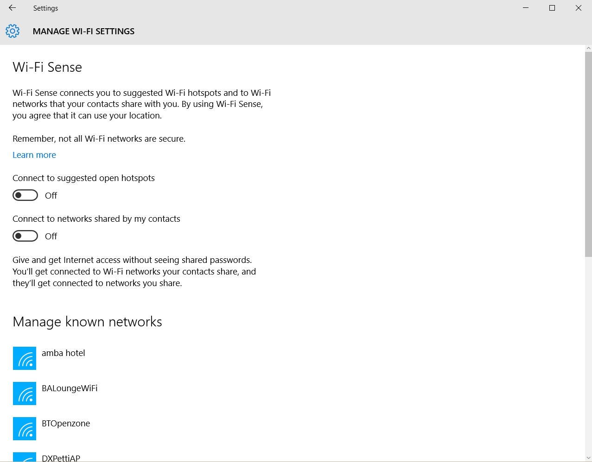

Windows 10 introduced a feature named **Wi-Fi Sense**. This feature will share your saved Wi-Fi configuration, including WEP and WPA passwords with your contacts across various platforms.

This feature hasn't been received well, and namely so. Not everyone wants to share their home Wi-Fi with every John, Dick & Harry they have on Facebook.

If you didn't turn this off at the time of installation or upgrade (bet you didn't click on Advanced Options huh...), let's do this now:

1. Click Start button, search for ```change wi-fi``` and click on **Change Wi-Fi s****ettings**
2. Scroll down to the bottom and click **Manage Wi-Fi settings**
3. Change the slider on **Connect to networks shared by my contacts** from On to **Off** _as pictured below:_



While you are there, I would strongly suggest doing the latter step for **Connect to suggested open hotspots** too. No one should be automatically connecting to insecure wi-fi networks.

Microsoft had their heart in the right place but in today's increasing volatile cyber world, this isn't their smartest play.
