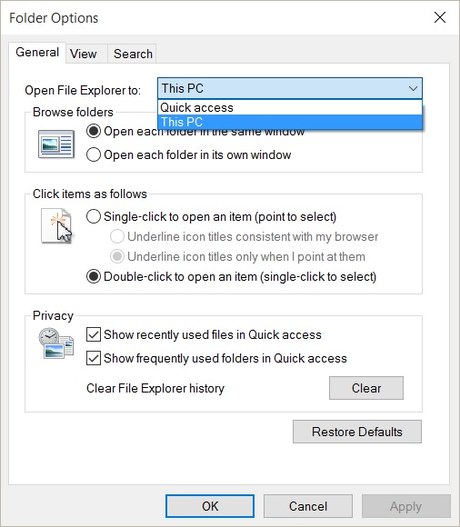

One of the new features of Windows 10 is **Quick Access**. Essentially a list of recent and repetitively accessed file and folder locations, Quick Access aims to bring you what you want, everywhere. Seems like a good idea.

But now, when you open File Explorer, it is the default view instead of the typical Windows 7/8 view where by you were presented with the standard User folders (Documents, Pictures etc...) plus disk drives. Not everyone, especially veteran Windows users, will enjoy this change.

Thankfully, it is rather simply to revert the view back to how it was in Windows 7/8:

1. Open **File Explorer**
2. Click on the **View** tab, followed by the **Option** icon
3. Click on the **Open File Explorer to:** drop down box and change to **This PC** _as pictured below:_

Now File Explorer's default view will look like something that Windows 7/8 users are much more accustomed to.

You can go one step further and untick both **Show recently used files in Quick access** & **Show frequently used folders in Quick access** to make Quick Access functionally the same as the old Favourites list in Windows 7/8.
