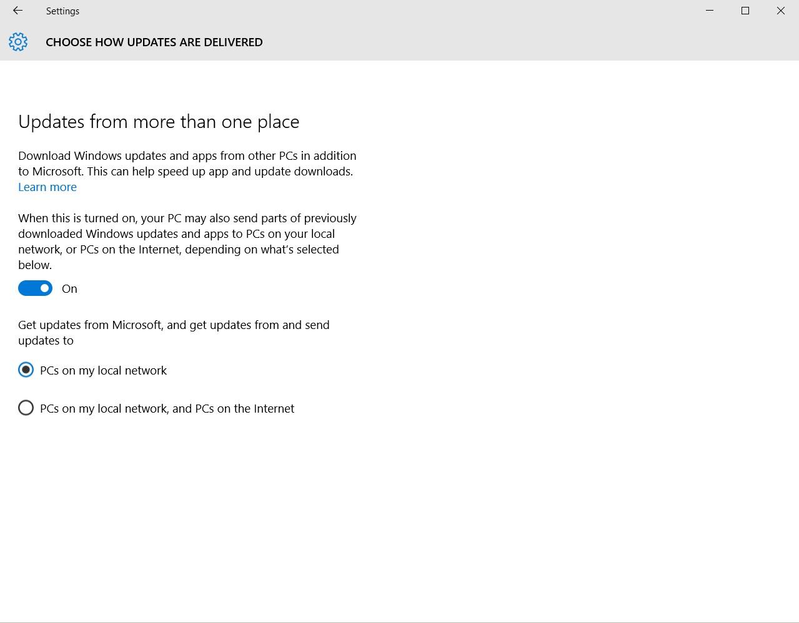

Microsoft, in a effort to reduce load on their own server farms as well as provided a better experience to customers when using Windows Update, Windows 10 introduces peer to peer technology (like Bittorrent uses) to deliver Windows update.

What does that mean for the average joe? Well, it means that your computer running Windows 10 will not only download updates but it will also updates updates to other computers around the world. Your computer, because a server essentially for Windows Update.

Not everyone is thrilled with this function.

Lucky enough, it is easy to turn off:

1. Press Start key, type in _updates_ and click on the **Advanced Windows Update Options**
2. Click on **Choose how updates are delivered**
3. Click on the slider to change from On to **Off**

Alternatively, you can use this technology to your advantage; if you have multi computers running Windows 10 in your home then instead of performing **Step 3**, keep the slider to the **On** position and change the the lower option from PCs on my local network, and PCs on the Internet to **PCs on my local network** _as pictured below:_

This way, you can reduce your internet usage and share the updates only among those computers at your home.
