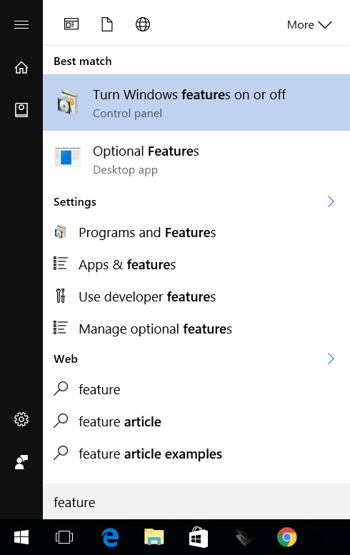
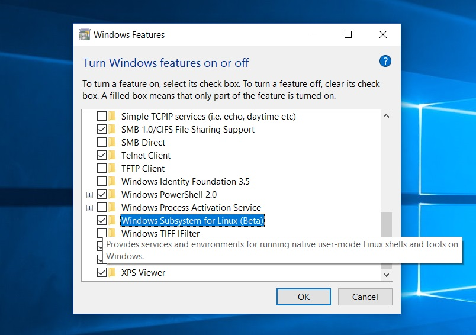
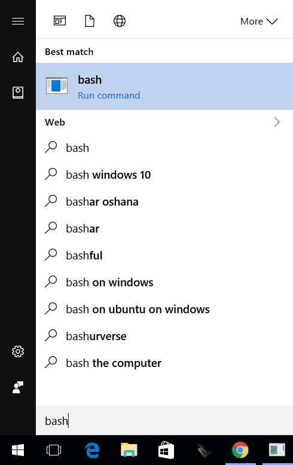
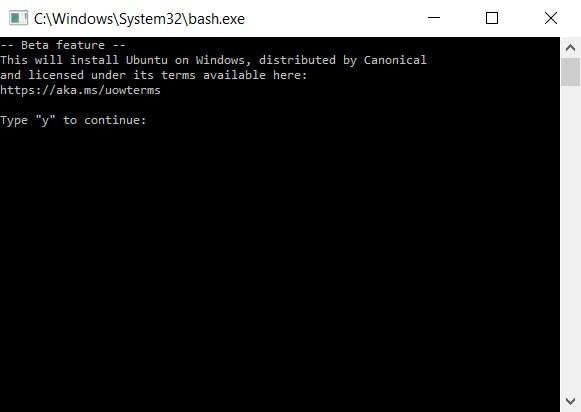
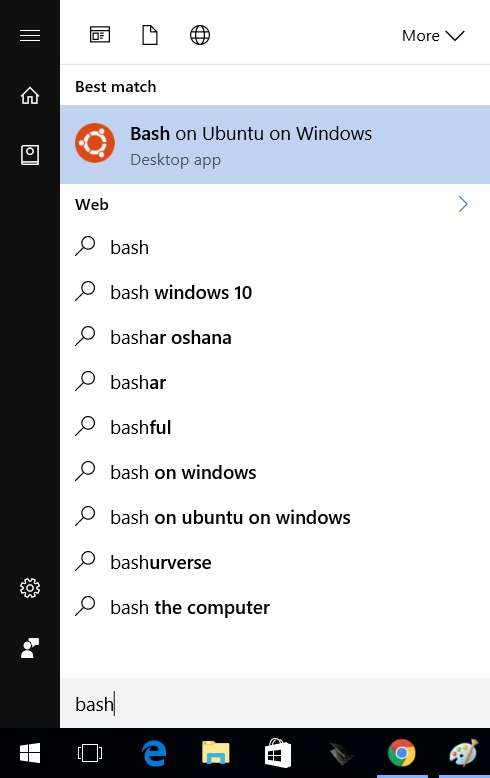

No no, the latest update to Windows 10 will not make you want to _bash_ your head against a brick wall; Update 1607, otherwise known as Anniversary Update 1 (code name Redstone 1) brings a very surprising feature to the Windows landscape; Linux on Windows.

While the ability to run Linux within a Windows environment is nothing new courtesy of the various flavours of virtualisation technology out there, Microsoft & Canonical's new way is something similar to the Windows on Windows platform that allows x86 applications to run on the now dominate x64 architecture. Entitled, **Windows Subsystem for Linux**; WSL for short, will allow you to run the same applications you know and love from Linux under BASH (Bourne Again SHell) straight in Windows. No virtualization, no recompiling, no Docker containers; this subsystem is a [real time translator of Linux system calls to Windows system calls](http://insights.ubuntu.com/2016/03/30/ubuntu-on-windows-the-ubuntu-userspace-for-windows-developers/).

## How do I get BASH?

1. Run Windows Update and get all the latest updates. You are looking for **Feature update to Windows 10, Version 1607**
2. Once installed and you have restarted, hit your Windows key to open your Start menu and type in ```feature``` and select the **Turn Windows features on or off** as pictured below:

3. Scroll down the list in the new window and find **X**, tick the checkbox besides it and hit **OK** like below:

4. When prompted, restart your computer
5. Now that you are back at your desktop, hit your Windows key to open your Start menu and type in ```bash``` and select the **bash (Run command)** entry as pictured below:

6. This will launch a command prompt window prompting you to download the application from the Windows Store like below. Type in ```y``` followed by the **Enter** key to start the download.

7. Once the download and subsequent installation is complete, you will be prompted for a username and password of your choosing for the environment.

And that is all she wrote. You now have a Windows Subsystem for Linux running on Windows 10 (ugh, that name needs reworking). The environment can be found by searching for bash in your Start Menu, like so



and you will launch into your very own, Linux Kernel v3.4 running space.

_Bash away_
