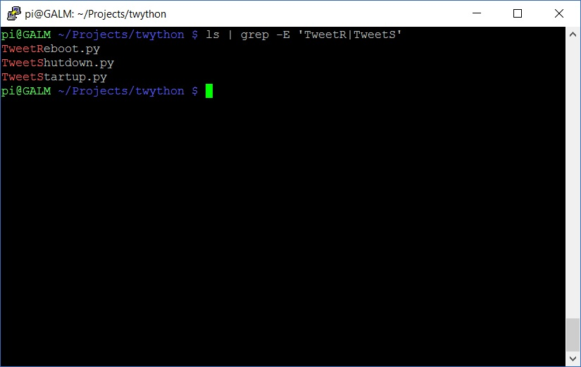

[Part 1 of the series]() saw us signing up to Twitter and getting access to the API to send tweets, setting up Twython and developing out shutdown script. Now we will make our script executable and run it.

## Run the Python script

With the script saved (CTRL+X then Y in Nano to exit and save) we first have to make it executable:

```bash
sudo chmod 700 TweetShutdown.py
```

With the script file executable by the file owner we can run it using:

```bash
python TweetShutdown.py
```

And if everything was done correctly, you will get something similar to this:


 

Alright, good start so far. But, we don't want to be notified just when the Pi gets shutdown, we want to know if its going to restart and we want to know if it successfully started back up again.

The working guts of the script won't have to change, so lets go ahead and make a couple of copies to perform the restart and startup verification respectively:

```bash
cp TweetShutdown.py TweetReboot.py
cp TweetShutdown.py TweetStartup.py
```

and let's not forget to make them executable as before:

```bash
sudo chmod 700 TweetReboot.py
sudo chmod 700 TweetStartup.py
```

Next, go ahead and open up the two new script files and edit the following line to adjust the message that will be tweeted accordingly

```python
tweet = "@DXPetti I'm going down #GALMPI "
```


Be mindful to keep the space at the end before the final quotation mark to separate the message and the date and time stamp.


So now we have 3 Python scripts, executable by the owner that will tweet out a time stamped message indicating a shutdown, restart and startup...



...but they currently have to be manually executed, which isn't very helpful to our goal in having a hands off monitoring system. We will make use of the run levels system of Linux in the next part to have these scripts executed when the system is shutdown, restarted and started up.
