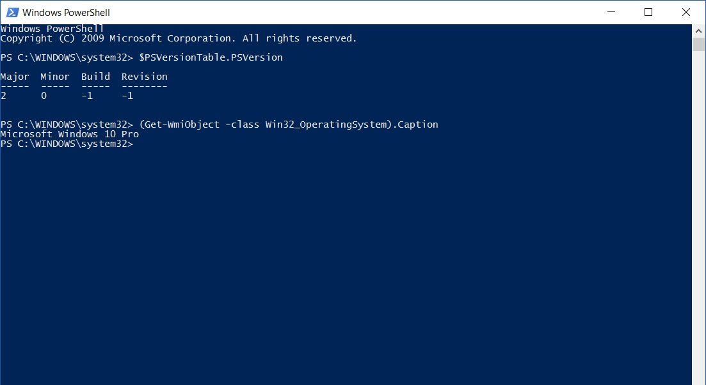

I hit a brick wall today while smashing together various PowerShell code snippets for a script I am working on (that I'll share later). I had my code nice and clean, commented, versioned and working...until I decided to test against a earlier version of Windows whereby my excitement was promptly shattered (thanks Windows 7).

A good lesson from this is to always test, test and do more tests before you pop the cork on the champagne.

But having multiple dev workstations are a royal pain to maintain, even in the glorious era of virtualisation.

Thankfully Microsoft have made this somewhat easier with the ability to direct PowerShell what version it should be running in. Once you have your code ready to go (or your are going to freestyle in the shell) open up a run prompt and enter the following:

```powershell
powershell.exe -version x
```

Just replace the _x_ with the numerical version of PowerShell you want to run and TADA, you will find yourself in a PowerShell version of your choosing:



This method can also be used when you are calling scripts in a shortcut, SCCM package or other places good PowerShell scripts are found via the same method, for example:

```powershell
powershell.exe -version 2 .\fancyscript.ps1
```

Now you can test your code to your hearts content from the one workstation without too much effort.

And if you have forgotten what version of PowerShell comes with what version of Windows, take a look below:

| PowerShell Version | Default Windows Versions |
| --- | --- |
| PowerShell 2.0 | Windows 7, Windows Server 2008 R2 |
| PowerShell 3.0 | Windows 8, Windows Server 2012 |
| PowerShell 4.0 | Windows 8.1, Windows Server 2012 R2 |
| PowerShell 5.0 | Windows 10 |
| PowerShell 5.1 | Windows 10 Anniversary Update, Windows Server 2016 |

Enjoy
