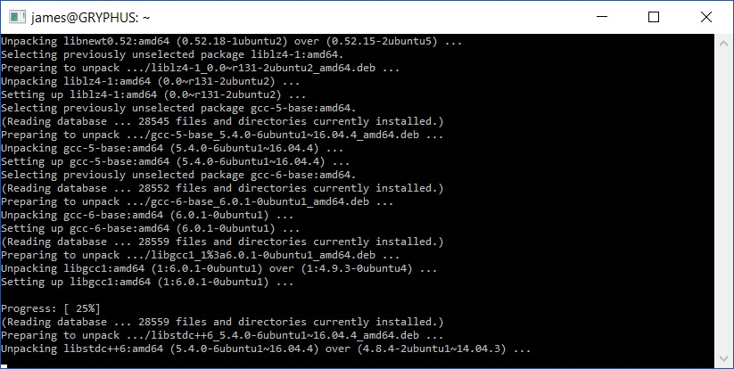
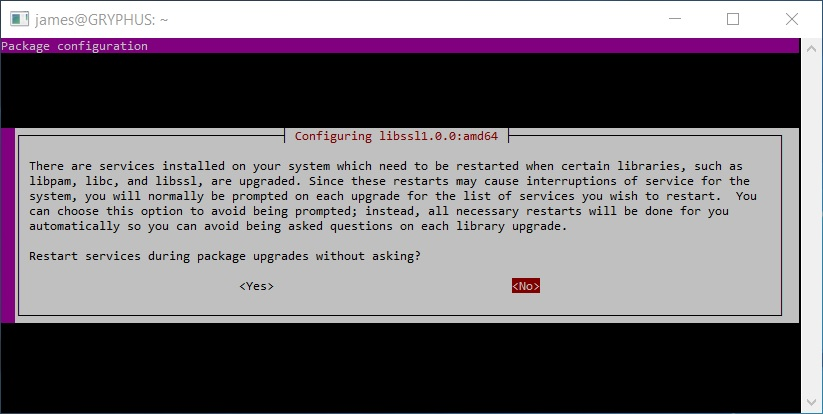
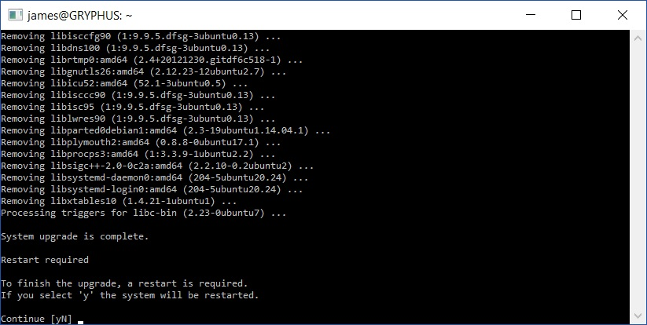
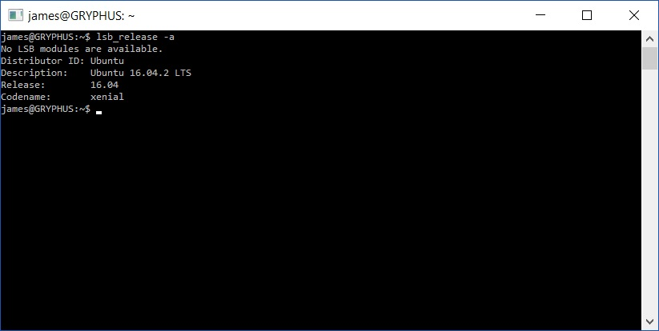

[Windows 10 Creators Update]() was made available to the masses on Tuesday gone by. While there are plenty of user facing features to be had, plenty of things have changed for the Windows Linux Subsystem (WSL).

First and foremost, Ubuntu 16.04.02 LTS has been made available for new and existing installs. Plenty of the ever day tools have been made available or modified to perform just as they were if you were running it from a Linux box including:

- _Core tools: apt, sed, grep, awk, top, tmux, ssh, scp, etc._
- _Shells: Bash, zsh, fish, etc. Dev tools: vim, emacs, nano, git, gdb, etc._
- _Languages & platforms: Node.js & npm, Ruby & Gems, Java & Maven, Python & Pip, C/C++, C# & .NET Core & Nuget, Go, Rust, Haskell, Elixir/Erlang, etc._
- _Systems & Services: sshd, Apache, lighttpd, nginx, MySQL, PostgreSQL_
- _And many, MANY others_

To enjoy all the latest features of the update WSL environment you can perform a quick uninstall/reinstall as demonstrated in [my previous post]() or you can perform a in place via the following method:

## Ubuntu Upgrade Manager

```bash
do-release-upgrade
```

With the update process kicked off, the upgrade manager will do it's thing.



Unlike a Windows update, this one will require you to hang around. Depending on the packages you have installed, some may prompt on how to perform upgrades or whether to install the new package version such as libssl package.



After many questions answered you will be informed that the upgrade is complete and a restart needs to be performed to finished it off.



With the upgrade to WSL complete, you can verify it by running:

```bash
lsb_release -a
```

and see something similar to the below:



Happy BASHing on [Xenial Xerus](https://wiki.ubuntu.com/DevelopmentCodeNames)
