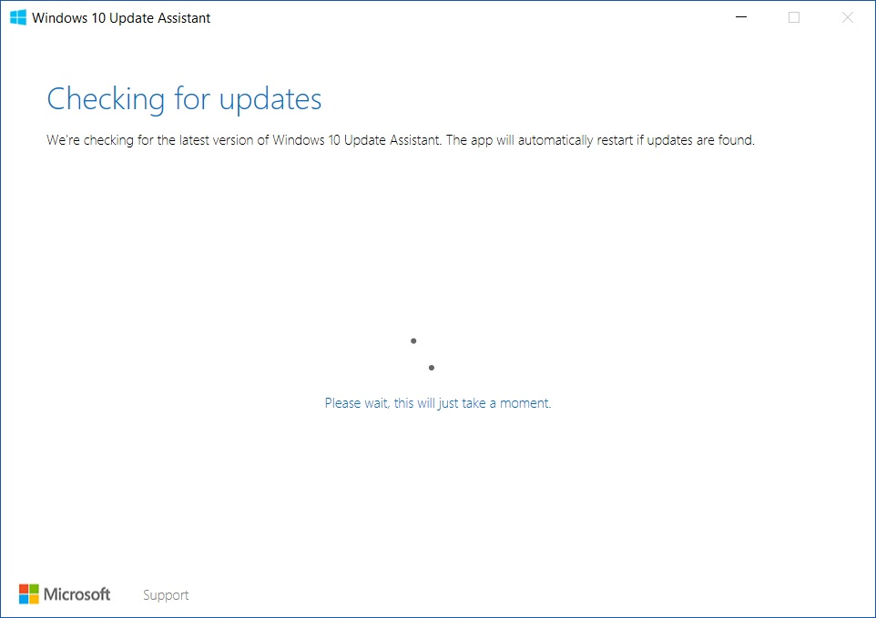
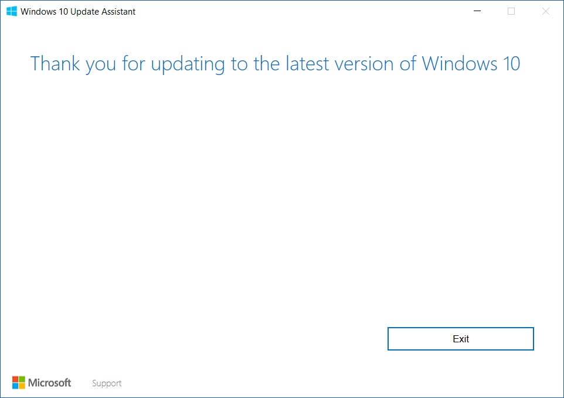
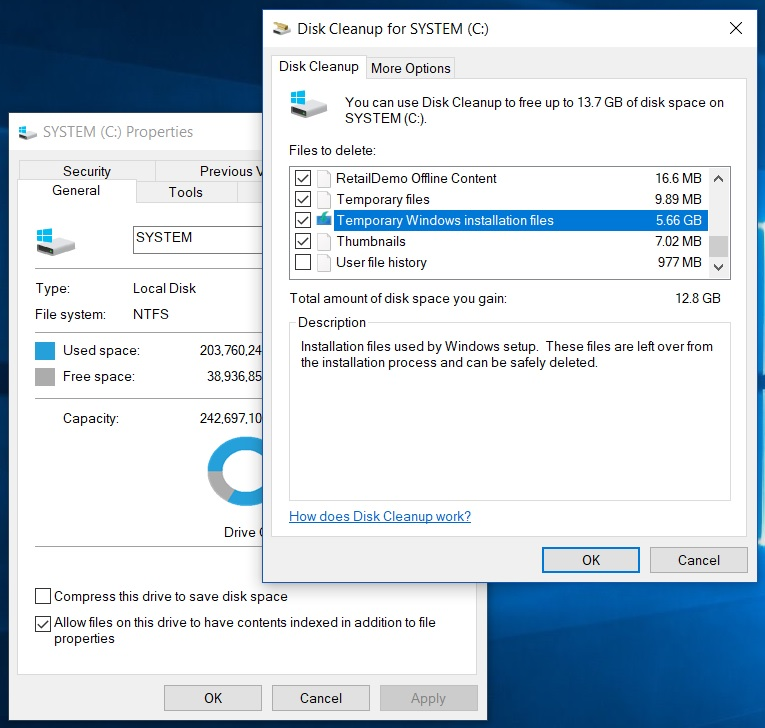

With a drop in testing and in it's place, a variety of fast and slow rings to roll out updates to Windows 10 users globally, many are clamouring for the latest major revision to Windows 10 entitled 'Creators Update' _(or for those with a liking for codenames or versions, that's Redstone 2 and 1703 for you)_.

Thankfully, it seems that Microsoft has learned it's lesson from the Anniversary Update, where people tried all manner of registry, DNS and time/date hacks to hasten the update to arrive on their workstation; by introducing the Windows 10 Update Assistant tool.

Downloading and installing any and all prerequisites required for the Creators Update is handled by the tool. All you need to do is head on over to the link below, download, run the tool and follow the bouncing ball.

[http://go.microsoft.com/fwlink/?LinkId=823120](http://go.microsoft.com/fwlink/?LinkId=823120)

Once the tool does its thing you are even thanked for taking time out of your busy schedule to update.

How quaint.

Don't forget to run a disk cleanup and remove the old version of Windows (if you don't want to do a restore) to reclaim back some space.

