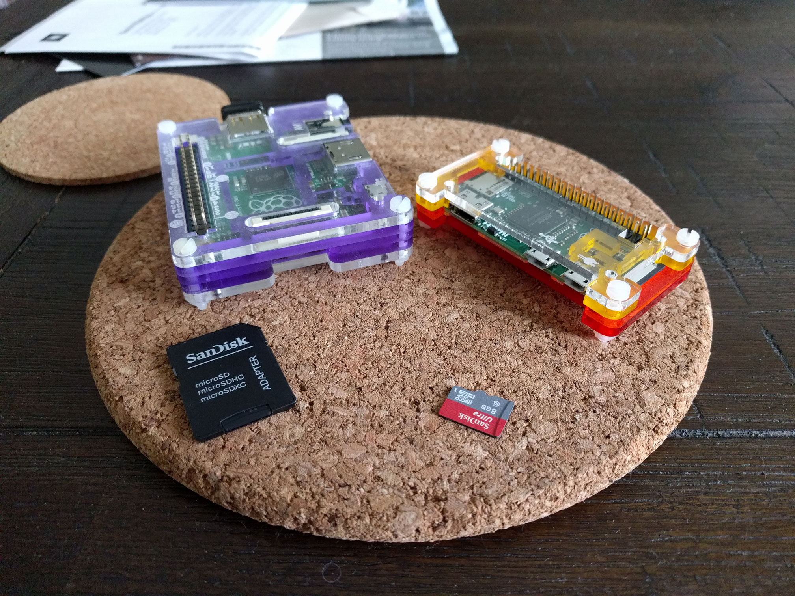

At some point last year I decided to expand my love of Pi from the A+ unit I have played with [over the last couple of years]() to a shiny Zero (which has since been replaced with the Zero W which includes Wireless and Bluetooth) and the Unicorn pHAT from the pirates at Pimoroni.



Sadly it has sat and gathered dust while my A+ continues to be my Pi server of choice. After updating the firmware and apps during the week it was no longer as stable as I desired. This gave me the necessary push to migrate to the Zero, and with that, setting up a Pi in headless configuration.

Now this isn't all that difficult when the Pi is plugged into a monitor over HDMI but what if you don't have a spare monitor + keyboard/mouse?

## Get Raspbian

Head on over to [Raspian section on the Raspberry Pi Foundation's website](https://www.raspberrypi.org/downloads/raspbian/) and grab the latest copy of Raspbian LITE (no use having the PIXEL/Desktop version if we are going headless).

## Apply Raspbian to the SD Card

Download a image writer such as [Win32DiskImager](https://sourceforge.net/projects/win32diskimager/) (for fellow Windows users) and apply the Raspbian LITE .IMG file to the SD Card.

## Configure for headless operation

To improve security, the Raspberry Pi foundation have disabled SSH access by default in the Raspbian images. Weird as hell decision for the LITE image _(although I could understand for the PIXEL image)_ but alas, it is easy to remedy.

Use a text editor and create a file named "ssh" on the Boot partition of the SD Card (which should now be visible after successfully applying the image in the previous step).

If you are running of WiFi, create another file in the same location named "wpa\_supplicant.conf" and enter the below as the contents:

```plain
ctrl_interface=DIR=/var/run/wpa_supplicant GROUP=netdev
update_config=1
country=xx
 
network={
    ssid="xx"
    psk="xx"
    key_mgmt=WPA-PSK
}
```

Replace the x's with your country code from [here](https://www.iso.org/obp/ui/#search), wireless network name and password respectively.

## Plug and play

Pop the SD Card into your Raspberry Pi, plug in your power, check your routers DHCP logs for the latest client to connect to your WiFi and point your favourite SSH client to pi@_ipaddressofpi_

Once you are in I suggest running the following:

```bash
raspi-config
```

which is the built in configuration utility for Raspbian and running the update option, change the hostname, password and memory split down to 16mb for the GPU. Don't forget to update the operating system via

```bash
sudo apt-get update && sudo apt-get upgrade
```

Last but not least, get rid of passwords altogether and [setup certificate based authentication]().

Now you have no excuse for those Pi's gathering dust. Get them on, connected and computing!
