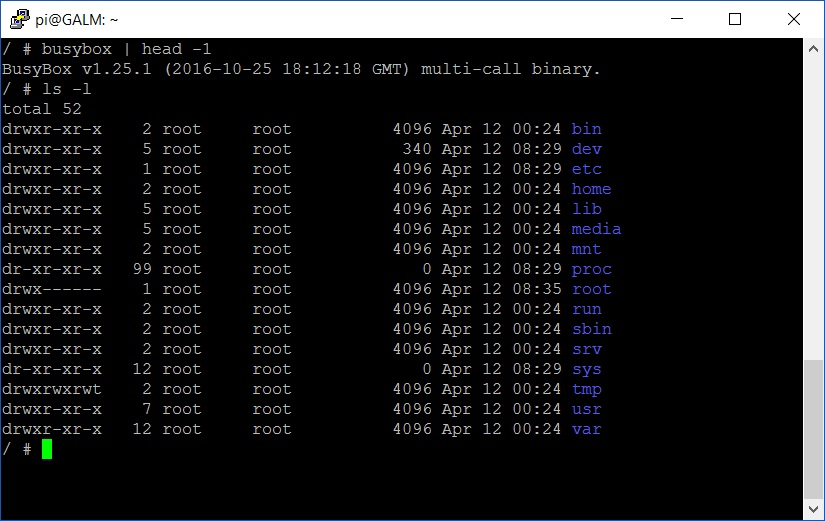
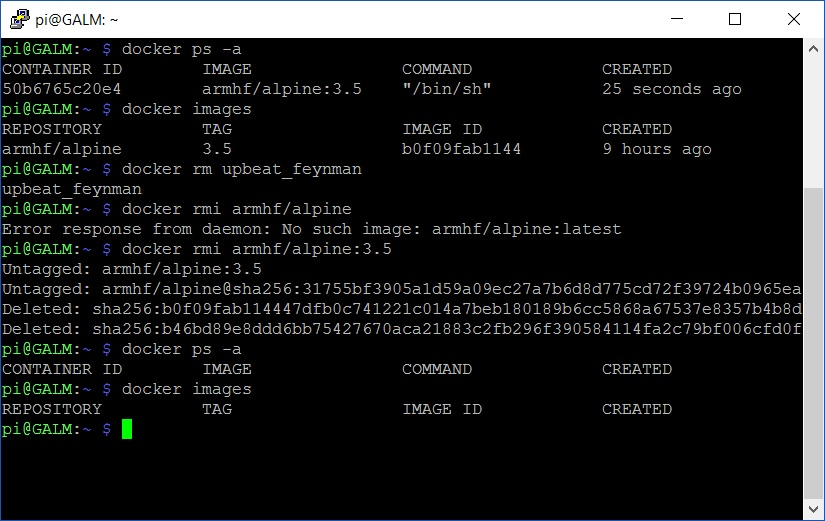

In the [previous blog post](), we setup and configured Docker on the Raspberry Pi. Now why don't we run a very basic Docker image to test our install is working a-okay?

```bash
docker run -ti armhf/alpine:3.5 /bin/sh
```

Let me breakdown this command:

```bash
docker run
```

tells docker to run the command that precedes it in a container

```bash
-ti
```

states to allocate a TTY shell plus run the container in Interactive mode

```bash
armhf/alpine:3.5
```

is the Docker Hub user, container image and image version to use and finally

```bash
/bin/sh
```

is the command to run inside the container image.

To expand further, we use the armhf user's images because they are compiled in the same architecture (ARM) that the Raspberry Pi runs. Images compiled on x86/x64 architecture wouldn't run on the Pi (although Docker are working towards a architecture-less build down the line). We use the Alpine container image as Alpine Linux is a positively tiny distribution of Linux. Smaller the better when it comes to containers, especially on small hardware such as the Pi. Less bloat, more GO!

Alright, so, what did we get with the command? Basically you have a Busybox shell, running inside Alpine Linux inside a Docker container.



Drop out of the container with a swift ```exit``` command and we will go into some basic management in Docker.

Now that we know and have a container running, how can we check?

```bash
docker ps -a
```

The above will list all containers, running or not. How about listing what images are on the host?

```bash
docker images
```

Easy huh?

Let's say you are done with your running container; how do you get rid of it? Take note of the randomly generated name from the ```docker ps -a``` command earlier and run the following to stop and remove the container:

```bash
docker rm containername
```

How about we continue the clean up and remove the image file too?

```bash
docker rmi imagename:tag
```

Once complete, you can re-run the commands from earlier to verify if the container + image has been removed from the host.



Well done! Docker basics down pat. Now I suggest you explore the official [Getting Started](https://docs.docker.com/engine/getstarted/) guide and for a Raspberry Pi flavoured spin, get friendly with Docker Captain, Alex Ellis' [Getting Started](http://blog.alexellis.io/getting-started-with-docker-on-raspberry-pi/) post and expand your container horizons.
