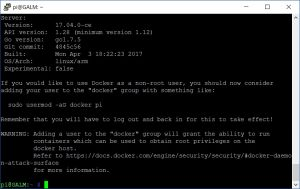
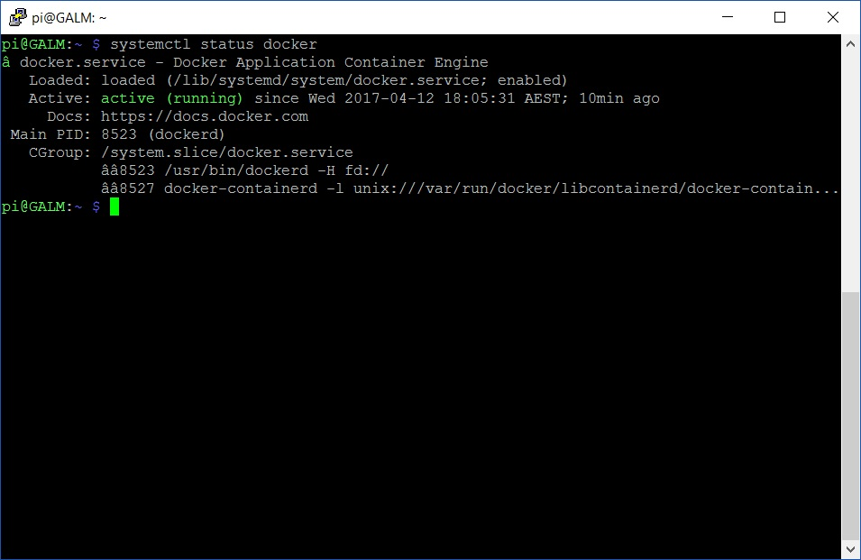
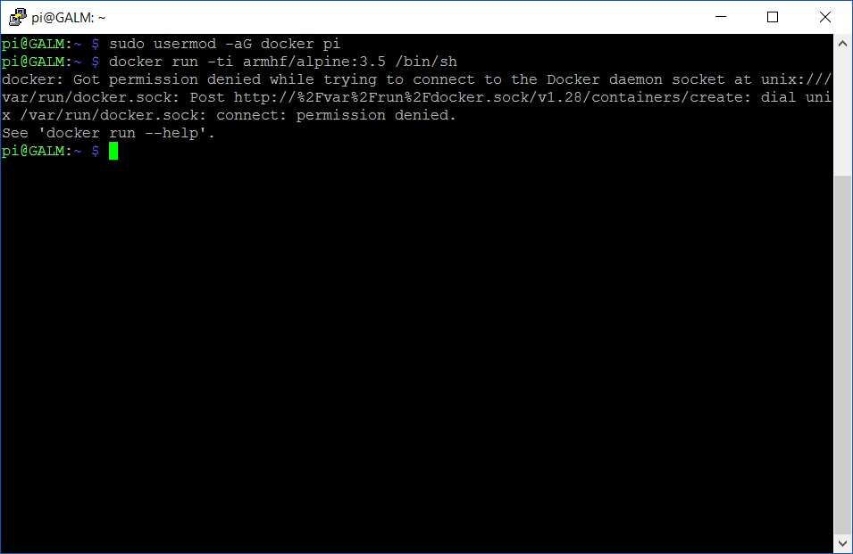

With the [1.12.1 release](https://github.com/docker/docker/releases/tag/v1.12.1), Docker is now officially supported on the Raspberry Pi. Hooray!

I personally love containers for the ability to build once, run many across a multitude of different operating systems and one day, even architectures. Because I am a bit of a neat freak, it also is very beneficial that Docker helps keep applications from spreading their dirt all over the host's filesystem (OpenVPN is a classic for this).

With that said, how do we get Docker? Very simply.

At your shell prompt, enter the below:

```bash
curl -sSL get.docker.com | sh
```

Once it has been downloaded and unpacked from the repos it will present you with the Docker version and a few handy tips we will go into in a moment:



Before we go any further, let's add it the daemon that manages the Docker infrastructure as a auto starting service and kick it off:

```bash
sudo systemctl enable docker && sudo systemctl start docker
```

We can verify the service been added and successfully started by dropping the following code:

```bash
systemctl status docker
```

You should be presented with something similar to the below with happy green text telling us all is good:



Now you are all ready to go but Docker will require elevating with **sudo** unless you add your user (usually _pi_ on a Raspberry Pi) to the Docker security group with the below:

```bash
sudo usermod -aG docker pi
```

Make sure you reset your TTY session otherwise you will get permission denied errors for not elevating



Now what? In my [next post]() we will run a basic image inside a container. Stay tuned!
