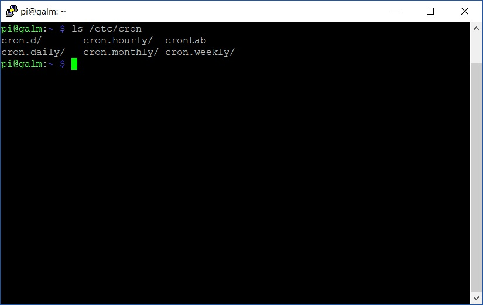

In our [previous entry](), we unleashed the awesome that is Pi-Hole inside a Docker container to make all the devices in our network ad-free when browsing the internet. Now while that is a good start, you want to keep your container running the latest and greatest version of Pi-Hole right? Now while the containerised version disables Pi-Holes built in upgrade mechanisms, you still can upgrade it in a way that containers are designed to...by phoenixing them!

## Refresh the container script

First off, lets open up nano (or your favourite text editor) and create a script file:

```bash
nano refreshpihole.sh
```

Next, punch in the following code:

```bash
#!/bin/bash
 
docker pull diginc/pi-hole-multiarch:debian_armhf
docker rm -f pihole
/path/to/pihole/launch/script.sh
```

If you have checked out any of my other [Docker based posts](), the above should be self explanatory.

```bash
docker pull diginc/pi-hole-multiarch:debian_armhf
```

This downloads the latest version of the container image. Remember to confirm which image:tag you require for your particular device.

```bash
docker rm -f pihole
```

The above then goes and trashes the currently running Pi-Hole container.

```bash
/path/to/pihole/launch/script.sh
```

Last but not least, we execute the [previously created Pi-Hole script]() to launch it once more, albeit with a fresh and updated image.

Once you have saved and exited out of the script, don't forget to make it executable with ```chmod```.

## Schedule the script with Cron

Cron, named after the Greek word for time, _chronos_, is a scheduling system across Linux distributions. Cron has various ways to schedule commands and scripts. One way is with the ```crontab -e``` command which will open the per user Cron schedule with a custom version of the text editor VIM. Alternatively, there are predefined folders under **/etc/**:



Simply copy your script file to refresh the Pi-Hole installation to the folder of your choice and it will be executed by Cron on that schedule:

```bash
sudo cp /path/to/script/refreshpihole.sh /etc/cron.monthly
```

With the above, Cron will execute our copied script (and any others in that folder) on a monthly basis.

## Summary

The above gives us a small but important example in how Docker and container systems broadly  are advantageous over running apps and services on a traditional virtual machine with (hopefully) a patching regime in place. Here we have a important component of our infrastructure that is being kept up to date, has a small footprint across our file-system and operating system, while keeping configuration and logs persistent with minimal downtime.
