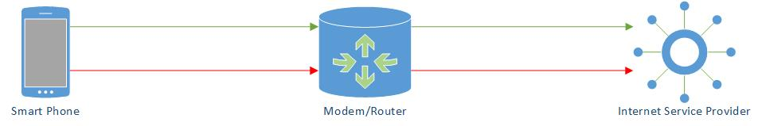
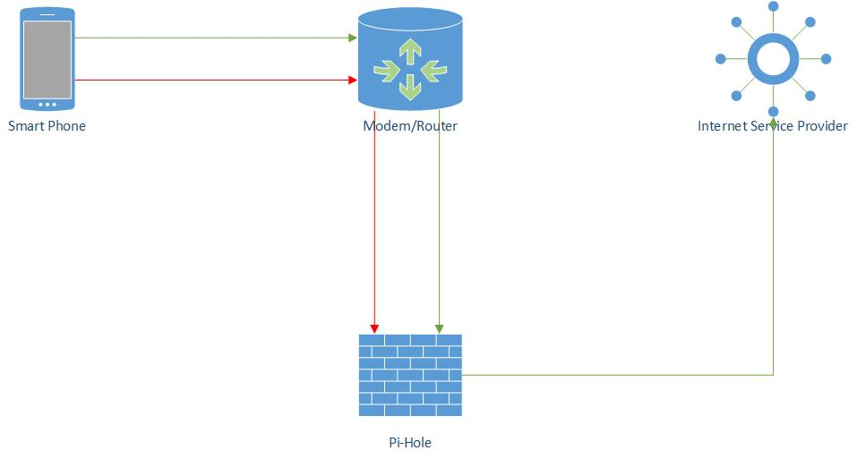
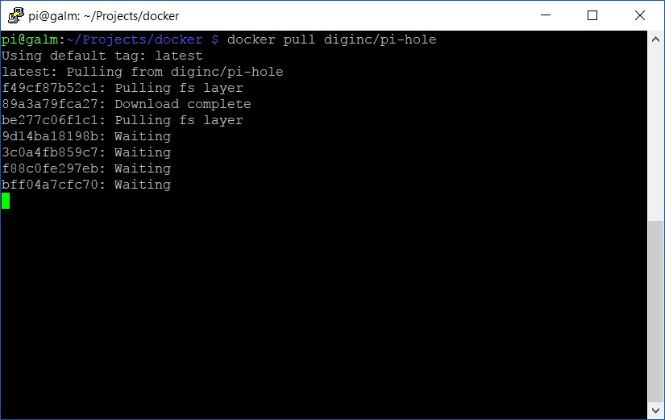
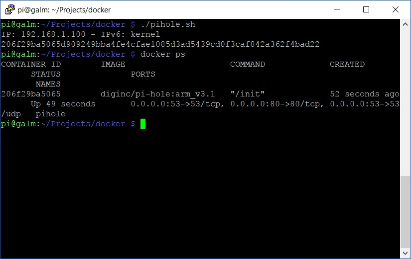

The other day I had a friend ask advice on what seemed to be a DNS related issue. Eventually the conversation traversed the topic of what (or whom) do I use for DNS for my home internet? I briefly explained that my router sends it's DNS queries via Pi-hole running on my Raspberry Pi.

This got me thinking about my Pi-hole implementation; running for 5 or so months without updates or any real issues, it's about time I shared how I run it and maybe some improvements can be made along the way.

Before we dive in, let's do a quick intro about Pi-hole.

## What is Pi-Hole

Pi-Hole is self described as a black hole for advertisements on the internet. If you haven't noticed on all your internet connected devices, advertisements are prevalent across all mediums of the internet. Whether it be a mobile phone game, a blog about gardening, a reputable news website or a Google search result; chances are, it has advertisements of some kind.

Pi-Hole assists in removing these advertisements from your internet viewing experience by being a man-in-the-middle.

If we take a look at a basic example of web traffic:



Smart Phone sends a DNS request for example.com website to have it translated into a IP Addresses. This request for both content (green) and advertisements (red) is sent to the Modem/Router which forwards the request to your ISP of choice.

But with a Pi-Hole in play:

]

Smart Phone sends a DNS request for example.com website to have it translated into a IP Addresses. This request for both content (green) and advertisements (red) is sent to the Modem/Router which forwards the request to the Pi-Hole. The Pi-Hole checks the domains against it's blacklist, example.com is a-okay so it forwards it on to your ISP as per normal. The advertisement (and the domain it originates from) however is bad juu juu and so the Pi-Hole forwards this traffic into the routing equivalent of /dev/null i.e. a blackhole and thus you never receive the advertisements.

Now the pros of doing this are numerous:

- It's network wide and thus end point devices don't need to be configured, including guests of your network (if configured on the Modem/Router as per above diagram)
- Because it is only checking against outbound DNS requests, it's quick and doesn't affect performance of your browsing experience
- Because the advertisements are getting blocked at the lowest layer (network), you may experience a increase in performance
- Doesn't affect inbound (downloading) connections
- You will reduce your total bandwidth consumption which in turn could result in $$ saved on your ISP bill

## Setup Pi-Hole with Docker

Alright, so now you know what Pi-Hole is, you want Pi-Hole, how do we get it?

With the assumption you have a [Raspberry Pi with Docker installed]() and ready to go, let's get started.

## Download Pi-Hole image

First off, we are going to download the latest build of Pi-Hole from the [Diginc Docker Hub](https://hub.docker.com/r/diginc/pi-hole/) by doing the following:

```bash
docker pull diginc/pi-hole-multiarch:debian_armhf
```


At the time of writing, there are issues with this tag on the Raspberry Pi. See the [issue tracker on GitHub](https://github.com/diginc/docker-pi-hole/issues/218?_pjax=%23js-repo-pjax-container). Instead, use the older diginc/pi-hole:arm\_v3.1 image and tag until it is resolved.


This will pull down the image that the Docker container will run in chunks at a time



## Create script to run the Pi-Hole container

Once the image is pulled down, create a script file that we will use to launch it in nano:

```bash
nano pihole.sh
```

From here, paste the following blueprint script

```bash
#!/bin/bash
IP_LOOKUP="$(ip route get 8.8.8.8 | awk '{ print $NF; exit }')"  # May not work for VPN / tun0
IPv6_LOOKUP="$(ip -6 route get 2001:4860:4860::8888 | awk '{ print $10; exit }')"  # May not work for VPN / tun0
IP="${IP:-$IP_LOOKUP}"  # use $IP, if set, otherwise IP_LOOKUP
IPv6="${IPv6:-$IPv6_LOOKUP}"  # use $IPv6, if set, otherwise IP_LOOKUP
DOCKER_CONFIGS="$(pwd)"  # Default of directory you run this from, update to where ever.
  
echo "IP: ${IP} - IPv6: ${IPv6}"
  
# Default ports + daemonized docker container
docker run -d \
--name pihole \
-p 53:53/tcp -p 53:53/udp -p 80:80 \
-v "${DOCKER_CONFIGS}/pihole/:/etc/pihole/" \
-v "${DOCKER_CONFIGS}/dnsmasq.d/:/etc/dnsmasq.d/" \
-e ServerIP="${IP:-$(ip route get 8.8.8.8 | awk '{ print $NF; exit }')}" \
-e ServerIPv6="${IPv6:-$(ip -6 route get 2001:4860:4860::8888 | awk '{ print $10; exit }')}" \
--restart=always \
diginc/pi-hole-multiarch:debian_armhf
```
_**Source:**_ [https://github.com/diginc/docker-pi-hole/blob/master/docker\_run.sh](https://github.com/diginc/docker-pi-hole/blob/master/docker_run.sh)

Now before we run this there are a couple of lines to point out. The first being this line:

```bash
DOCKER_CONFIGS="$(pwd)"  # Default of directory you run this from, update to where ever.
```

This environment variable sets where the docker container will store configuration data so it persists over restarts or future image pulls (I'll touch on why this is useful in a bit). I would suggest replacing **$(pwd)** which if you know your unix means 'present working directory' i.e. where ever you run your script from. Swap it out for someone more useful like a sub directory in your home folder.

The other line to take note is the following:

```bash
diginc/pi-hole-multiarch:debian_armhf
```

As noted earlier, there is currently issues with this image/tag on the Raspberry Pi so swap it out with the one suggested. Make sure to swap it back once resolved as this will ensure you are always running the latest (especially when we automate this process).

## Make script executable

If you have followed a number of my other [Linux posts](), you'll remember this one

```bash
chmod 700 pihole.sh
```
## Run Pi-Hole

Now execute the script and you will be prompted with your Raspberry Pi's IP address along with the container GUID. Once it is running you can confirm this by using the ```docker ps``` command



and finally, head to http://_YourRaspberryPisIPAddress_/admin and you will be presented with the Pi-Hole web gui


Now you have yourself a fantastic ad blocking solution running off your Raspberry Pi inside a Docker container! All you need to do is point your modem/router to serve it's DHCP clients the Pi-Hole/Raspberry Pi as its DNS and your all set.

Of course, if you don't like to live dangerously, you can point individual computers, smartphones etc at the Pi-Hole to test out the functionality before going network wide with the change.

In my [follow up entry](), I'll expand on why using Pi-Hole in Docker is advantageous through some easy automation to keep you running the latest and greatest.
