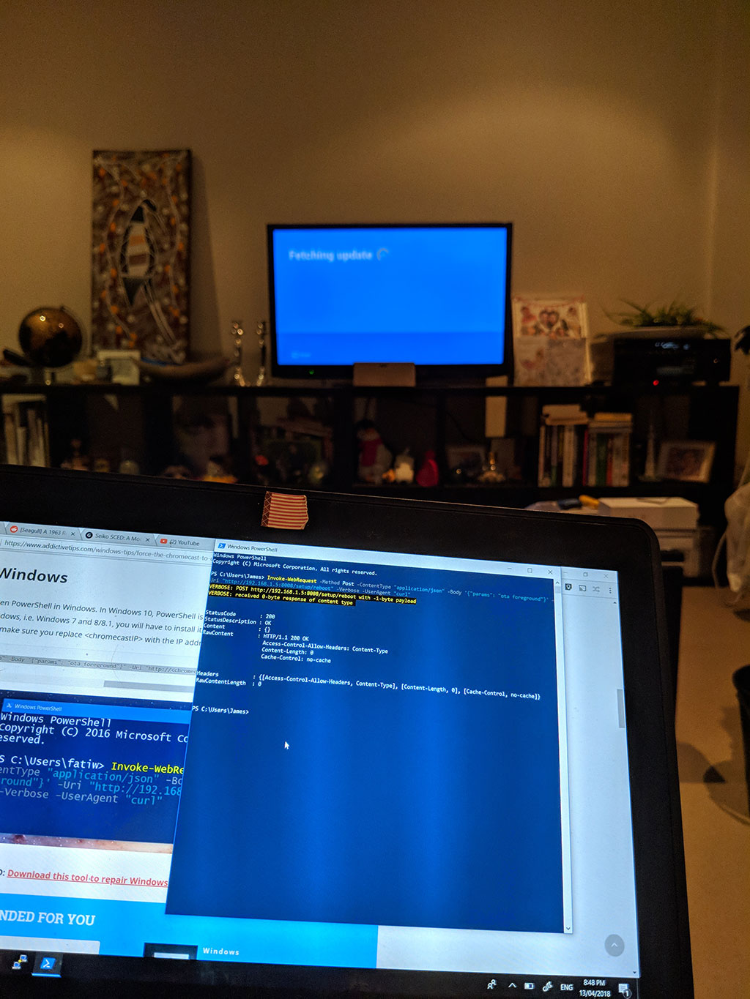

You probably took one look at the title and thought "what in the blue hell is this person on about?". I mean, how often do you suspect Chromecasts and Powershell go hand in hand?

In any case, some bright spark with, I'm guessing, a combination of Wireshark and a curious mind managed to discover the Over-The-Air (OTA) URL that Chromecasts check-in with to discover if there is a pending update to their firmware available. With this information, we are able to craft a JSON web request utilising the ```Invoke-WebRequest``` cmdlet in Powershell to force the Chromecast to get firmware updates. This can be very handy if you switch from or to the Beta firmware channel and are not the type to wait for [Google's idea of an update check](https://www.digitaltrends.com/mobile/android-check-for-update-button/) to occur.

Firstly, get the current IP address of your Chromecast from the Google Home app or by checking DHCP logs in your home router. Next, drop into a Powershell session and enter the following:

```powershell
Invoke-WebRequest -Method Post -ContentType "application/json" -Body '{"params": "ota foreground"}' -Uri "http://CHROMECAST_IP:8008/setup/reboot" -Verbose -UserAgent "curl"
```

Ensure you swap out **CHROMECAST_IP** for your own before sending the command off. Once run, your Chromecast should happily kick off the firmware upgrade process and you will receive a HTTP 200 response in the Powershell session.



Hat tip to [AddictiveTips](https://www.addictivetips.com/windows-tips/force-the-chromecast-to-update/#ampshare=https://www.addictivetips.com/windows-tips/force-the-chromecast-to-update/) from where I discovered this one.

More proof that Powershell can help you achieve just about anything.
