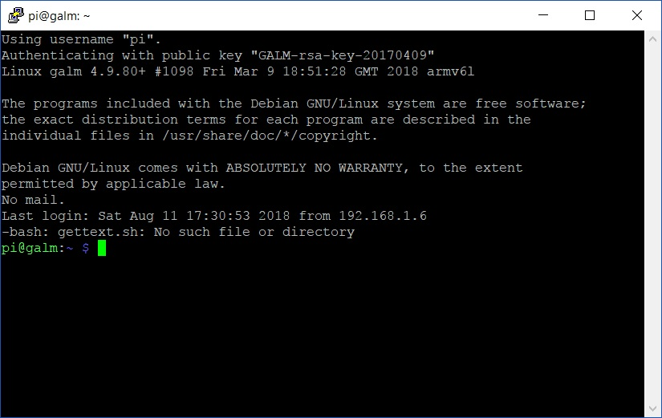
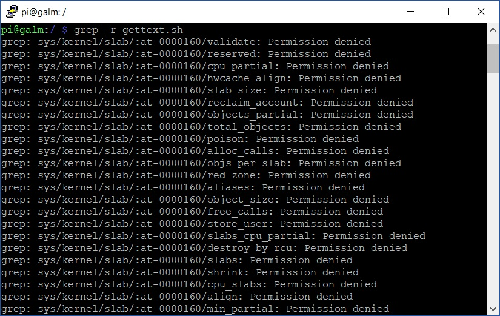
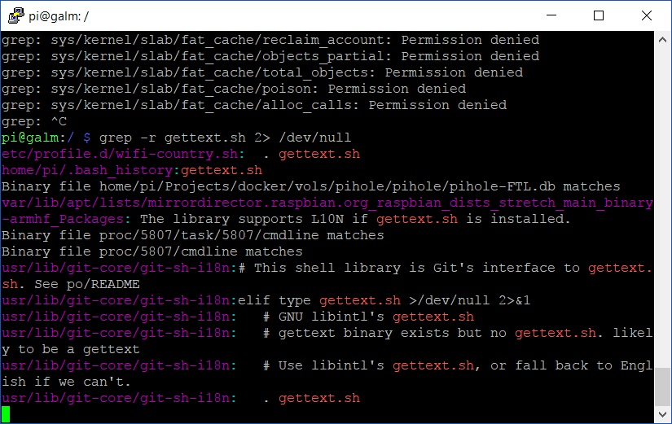

After coming back from a extra long holiday and noting that I hadn't received any [monitor tweets in a while from my Raspberry Pi](), I thought it was a good time to login and make sure everything was running as before. Sadly, it wasn't even getting an address on my home network. Once I had nutted out a few issues (more to come in future posts), I saw there was a script that wasn't correctly running at startup.



This _'gettext.sh'_ script was not familiar to me and had me concerned. My first thoughts ran to my ```rc.local``` file in **/etc/** but that the contents was unchanged. Next I inspected all my [cron tabs]() but once again, nothing out of the ordinary. How would I track down this mysterious script file?

## Enter grep

For those of you new to Linux distributions; grep is a fabulous tool that allows you to search the contents of data for strings in any variety. Very powerful when you combine it with other tools such as ```cat``` to output the contents of files like for example, log files.

Usage is simple;

```bash
grep stringthatIamlookingforward /location/to/search/in
```

So how would I find this elusive script file when it could be anywhere on the file system of my Raspberry Pi? First, because I want to search the entire file system, we should navigate to the root of said file system;

```bash
cd /
```

Now we can use grep to find the bugger!

```bash
grep gettext.sh
```

But hang on, nothing is happening. That is because grep is a processor of input and thus expects to be fed. So what happens if we explicitly specify the root of the file system, _'/'_ ? Well, you'll be reminded that _'/'_ is a directory and not a file. So how do we feed grep the entire file system? Well, tell it to search recursively with the -r switch like so;

```bash
grep -r gettext.sh
```

But I must warn you, if you do that, the majority of your result will be



That is far too much noise when finding a needle in the digital haystack. Sure, we could run the search under ```sudo``` but as the script failure appears at logon it surely must exist in userspace land. Lets take a lesson from all the way back in the early days of [scripting cryptocurrency miners to start on boot]() and send the _'standard error output'_ ala **2>** out to the blackhole of **/dev/null**. Thus, the final one liner will look like this;

```bash
grep -r gettext.sh 2> /dev/null
```



Now these are results I can work with. Off to chase this rabbit into Wonderland...
